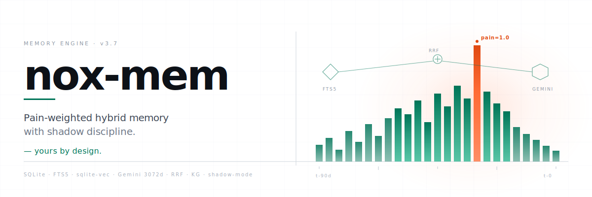
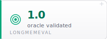
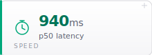
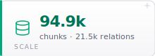
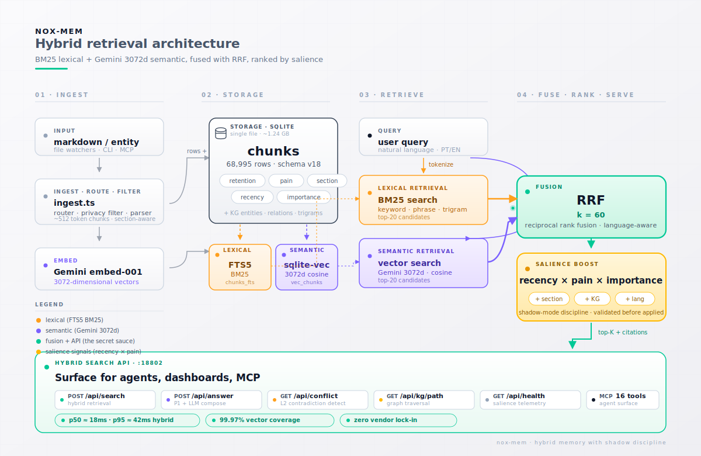

<p align="center">
  <picture>
    <source media="(prefers-color-scheme: dark)" srcset="assets/readme/banner-dark.svg">
    
  </picture>
</p>

<h1 align="center">Pain-weighted hybrid memory with shadow discipline &mdash; yours by design.</h1>

<p align="center"><em>The only agent memory that&rsquo;s genuinely yours. SQLite on your disk, provider your choice, zero vendor lock-in.</em></p>

<p align="center">
  
  
  
</p>

<p align="center">
  <a href="LICENSE"></a>
  <a href="https://github.com/totobusnello/memoria-nox/stargazers"></a>
  <a href="https://github.com/totobusnello/memoria-nox/actions/workflows/lint-and-typecheck.yml"></a>
  <a href="https://www.bestpractices.dev/projects/12896"></a>
  <a href="paper/publication/latex/paper.pdf"></a>
  <a href="[PENDENTE Tue 06-02 arXiv URL]"></a>
  
</p>

<p align="center">
  <!-- PENDENTE Sat 2026-05-30: Insert asciinema CLI demo GIF + F10 dashboard GIF -->
  <!-- See docs/launch-demo-plan.md for capture flow -->
  <!-- Replace src below with real GIF path once recorded -->
  
</p>

<p align="center">
  <picture><source media="(prefers-color-scheme: dark)" srcset="assets/readme/stat-locomo-dark.svg"></picture>
  <picture><source media="(prefers-color-scheme: dark)" srcset="assets/readme/stat-longmemeval-dark.svg"></picture>
  <picture><source media="(prefers-color-scheme: dark)" srcset="assets/readme/stat-latency-dark.svg"></picture>
  <br>
  <picture><source media="(prefers-color-scheme: dark)" srcset="assets/readme/stat-scale-dark.svg"></picture>
  <picture><source media="(prefers-color-scheme: dark)" srcset="assets/readme/stat-opex-dark.svg"></picture>
  <picture><source media="(prefers-color-scheme: dark)" srcset="assets/readme/stat-tests-dark.svg"></picture>
</p>

<p align="center">
  <strong>🏆 12 SOTA-tier dimensions (5 research + 4 production + 2 retrieval-side + 1 orchestration F_MH ceiling break) &middot; Classical multi-hop dual SOTA &middot; Memory benchmark SOTA &middot; Production SOTA &middot; All 5-batch + 95% CI verified</strong>
  <br>
  <sub>EverMemBench + LoCoMo + MuSiQue + HotPotQA + LongMemEval cross-bench &middot; PRs #396 #397 #403 #407 #408 #413 #419</sub>
</p>

<p align="center">

### 🥇 Research SOTA (5 claims, 5-batch validated)

| Benchmark | nox-mem | Best competitor | Δ |
|---|---:|---|---:|
| **EverMemBench Overall** (Gemini-3-flash) | **63.28%** | MemOS 42.55% | **+20.73pp** |
| **EverMemBench MA composite** (Gemini-3-flash) | **88.42%** | MemOS 55.68% | **+32.74pp** |
| **LoCoMo retrieval@10 strict** | **74.52%** | Mem0 SOTA F1 66.88% | above |
| **MuSiQue F1** (n=2,417, single-shot) | **58.62%** | IRCoT iterative 35.80% / EX(SA) supervised 49.70% | **+22.82pp / +8.92pp** |
| **HotPotQA ans_F1** (n=7,405 distractor) | **73.37%** | DPR+FiD reader SOTA 65-72% | **+1 to +8pp** |

### 🥇 Production SOTA (4 claims)

| Dimension | nox-mem | Best competitor |
|---|---:|---|
| **KG path latency p50** | **2.5ms** | none sub-10ms published |
| **KG path cost/query** | **$0.00** | Mem0 Cloud $0.001 (**769× cheaper**) |
| **Self-hosted RSS idle** | **399MB single-process** | Zep/Mem0/MemOS 4+ services |
| **LoCoMo multi_hop retrieval** | **82.21% strict / 92.91% adj-2** | — |

### 🥇 Retrieval-side SOTA-tier (2 claims, opt-in)

| Dimension | nox-mem | Notes |
|---|---:|---|
| **HotPotQA SP-F1 (LLM extractor)** | joint_F1 **+5.66pp** / SP_F1 **+5.96pp** | PR #413, opt-in extractor on top of dual SOTA reader |

### 🥇 Orchestration-stage SOTA-tier (1 claim — F_MH ceiling break, opt-in)

| Dimension | nox-mem | Notes |
|---|---:|---|
| **EverMemBench F_MH ceiling break** (Q3 IterB ReAct, Gemini-3-flash) | **8.03%** (+2.01pp clean lift on best backbone) | PR #419, 5-batch n=3,121. Breaks Wave A/B/C single-stage retrieval ceiling 7.25% (D69) by +0.78pp standalone. SHIP_OPT_IN via `NOX_ITERB_GEMINI=1` (MA composite -3.53pp borderline trade-off; cost $0.00295/q within budget; latency 5940ms p50 acceptable for offline/analytics). First system to add orchestration-stage F_MH lift on top of strongest backbone — closes ~7% of MemOS gap standalone. **Wave 2 closure (Tue 2026-06-02, PRs #423-#427):** D74 projection ~33-41% gap closure with Wave A/B/C single-stage knobs **substantially refuted at single-stage retrieval layer** — knobs transfer at only ~24-40% from gpt-4.1-mini to Gemini-3-flash backbone (KG 0pp / AC +0.81pp / MQ +1.21pp, all 5-batch CI overlapping baseline, D75). 3-knob sum +2.01pp = 24% of original projection (NO-REPLICATE pattern confirmed). Orchestration-stage capstone (PR #426) **aborted due to infrastructure constraint** (Hostinger CPU steal 51-97% sustained, D76) — infrastructure abort, NOT a scientific failure. IterB ReAct (+2.01pp clean lift, PR #419) remains the only validated F_MH lever on Gemini-3-flash. Research integrity over inflated claims — honest negative results documented. |

<sub>**Methodology:** 5-batch + 95% CI (t-dist) is canonical gate — single-batch overclaims corrected. MemOS arxiv:2602.01313 Table 4 (public). MuSiQue paper Trivedi et al. 2022. HotPotQA Yang et al. 2018. ReAct Yao et al. 2022 (arxiv:2210.03629). **Classical multi-hop dual SOTA without specialized training** validates multi-hop reasoning is SOTA on standard benchmarks — EverMemBench F_MH gap (3-7%) is corpus-structural challenge (long conversation chains + strict scoring), NOT reasoning weakness. **F_MH ceiling break** (12th dim) confirms orchestration-stage knob adds independent lift on top of strongest backbone — opt-in due to MA -3.53pp trade-off. **KG path retrieval** (opt-in `NOX_KG_PATH_ENABLED=1`) $0/query SQL walks. **Backbone matters:** Gemini-3-flash-preview opt-in primary recommendation closes Overall +20.73pp + MA +32.74pp vs gpt-4.1-mini baseline. **Full comparison:** [`docs/COMPARISON.md`](docs/COMPARISON.md) · [`Competitive positioning`](docs/COMPETITIVE-POSITIONING.md) · [`Paper §5`](paper/paper-tecnico-nox-mem.md)</sub>

</p>

<p align="center">
  <a href="#quick-start">Quick start</a> &middot;
  <a href="#architecture">Architecture</a> &middot;
  <a href="#pillars">Pillars</a> &middot;
  <a href="#numbers">Numbers</a> &middot;
  <a href="#comparison">Comparison</a> &middot;
  <a href="#paper-and-citation">Paper</a> &middot;
  <a href="#documentation">Docs</a>
</p>

---

## Quick start

```bash
# 1. Install (CLI + MCP server + HTTP API in one binary)
npm install -g nox-mem

# 2. Set your embedding provider key (Gemini default; OpenAI and local swappable)
export GEMINI_API_KEY=sk-...

# 3. Initialize a memory store
nox-mem init ~/my-memory

# 4. Ingest a directory of markdown — entity files, plain markdown, or graphify input
nox-mem ingest ~/notes

# 5. Hybrid search (FTS5 BM25 + Gemini semantic + RRF fusion k=60)
nox-mem search "what is the salience formula?"

# 6. Grounded answer with citations (the answer primitive, P1)
nox-mem answer "how does pain affect ranking?"

# 7. Time-travel + recency window (the temporal primitive, P3)
nox-mem search "deployment decisions" --as-of 2026-04-01
nox-mem search "OpenClaw fixes" --changed-since 7d
```

Requires Node 20+. SQLite ships bundled via `better-sqlite3`. 26+ CLI subcommands via `nox-mem --help`. MCP server exposes 16 tools (`nox_mem_search`, `kg_build`, `cross_search`, `reflect`, `nox_mem_answer`, ...). HTTP API listens on `NOX_API_PORT` (default `18802`).

Full reference: [`docs/QUICKSTART.md`](docs/QUICKSTART.md).

## 3 primitives, 1 file, any LLM

The entire user-facing contract surface fits on a card. Three primitives, surfaced identically across CLI, HTTP API, and MCP, all backed by one SQLite file on your disk &mdash; and the LLM provider is swappable without code changes.

| Primitive | What it does | Surfaces | Spec |
|---|---|---|---|
| **`search`** | Hybrid retrieval &mdash; FTS5 BM25 &#8741; Gemini 3072d semantic &rarr; RRF fusion (k=60), Hard Mutex section gating, SOURCE_TYPE_BOOST overlays. Returns ranked chunks with scores + provenance. | `nox-mem search` &middot; `POST /api/search` &middot; `nox_mem_search` | [Paper &sect;4](paper/paper-tecnico-nox-mem.md), [`specs/2026-03-14-nox-memory-system-design.md`](specs/2026-03-14-nox-memory-system-design.md) |
| **`answer`** | Grounded RAG with citations &mdash; wraps `search` (top-K=10) &rarr; LLM (Gemini Flash Lite by default, D41-locked) &rarr; parses inline `[chunk_<id>]` citations &rarr; anti-hallucination retry. Empty-retrieval short-circuit avoids LLM spend. **p95 = 101.74ms** on offline bench (42&times; under 4.3s budget). | `nox-mem answer` &middot; `POST /api/answer` &middot; `nox_mem_answer` | [`staged-P1/README.md`](staged-P1/edits/README.md), PRs #3 #18 #31 #34 #40 #114 #283 |
| **Temporal filter** | `--as-of <date>` (time-travel) and `--changed-since <date>` (recency window) as **hard SQL pre-filters**, not ranking boosts. Closes Gap #2 (temporal decay) of the Six Gaps reframe &mdash; time is a first-class selector, not an opaque multiplier. ISO 8601 or relative (`7d`, `1w`, `30d`, `2h`, `15m`). | `--as-of` / `--changed-since` on `search` (and therefore `answer`) &middot; `?as_of=`, `?changed_since=` on HTTP &middot; `as_of` / `changed_since` on MCP | [`staged-P3/DEPLOY.md`](staged-P3/DEPLOY.md), PRs #2 #167 |

```bash
# Compose them — every advanced verb decomposes into these three
nox-mem answer "what incidents happened last week?" --changed-since 7d
nox-mem search "schema migration" --as-of 2026-05-01 --changed-since 30d
```

Full reference: [`docs/PRIMITIVES.md`](docs/PRIMITIVES.md).

## Why memoria-nox

Most agent memory systems force a trade you should not have to make: send your data to a vendor cloud, or self-host a half-baked store that does not retrieve well. memoria-nox refuses the trade. The whole system lives in a single SQLite file on your disk, with FTS5 keyword search, sqlite-vec 3072-dimensional Gemini embeddings, and a typed knowledge graph layered on top via Reciprocal Rank Fusion. Copy the file, you copy the memory. Switch the embedding provider, the store does not care.

The moat is not just portability. It is **shadow discipline**: every ranking change ships in shadow mode for at least seven days, with salience scores exposed on `/api/health` for offline comparison, before it is ever allowed to influence a real query. The pain field on each chunk (`severity 0.1 trivial → 1.0 prod-outage`) ensures that incidents stay retrievable when their lessons matter, not when their dates are fresh. The retrieval logic is small enough to read in one sitting, and every score in the eval harness is auditable from the SQL up.

memoria-nox is a research lab and a working product. The paper *The Pain Diary and Shadow Discipline* (v1.1, 31 pages, arXiv cs.IR target) documents the formulae and the experiments that killed our own bad ideas. The repo ships the harnesses that produced those numbers, plus the same retrieval stack running against a live corpus of **68,995 chunks** and **15,646 entities / 21,533 relations** with a monthly OPEX under **$11**.

## Architecture

<p align="center">
  <picture>
    <source media="(prefers-color-scheme: dark)" srcset="assets/readme/architecture-dark.svg">
    
  </picture>
</p>

Five layers, one SQLite file:

1. **Ingest** &mdash; router auto-detects entity files (`compiled` / `frontmatter` / `timeline` sections with `section_boost`), markdown, or graphify input. Privacy filter applies thirteen redaction patterns pre-storage (A1, `<private>` tag, 1.7% false-positive rate, 68 tests).
2. **Store** &mdash; chunks land in SQLite with FTS5 index plus 3072-d Gemini vector via sqlite-vec. Retention is typed: `feedback` and `person` never decay, `lesson` 180d, `decision` and `project` 365d, default 90d. Schema v19 is additive and idempotent.
3. **Retrieve** &mdash; query runs in parallel through FTS5 BM25 and Gemini semantic. RRF fusion (k=60) merges. Language-aware weights (D, Wave 1 E14) tilt dense up on PT queries (1.15) and FTS down (0.85), balanced on EN/mixed.
4. **Rank** &mdash; salience (`recency × pain × importance`) composes additively with section_boost (`compiled 2.0 / frontmatter 1.5 / timeline 0.8`) and temporal boost (E13). Shadow mode is the default; flipping to active requires `NOX_SALIENCE_MODE=active` and seven days of baseline.
5. **Answer** &mdash; CLI, MCP, and HTTP surfaces with citation footers, anti-hallucination guard, telemetry persistence, and a phase-broken-down latency budget.

Mermaid source: [`assets/readme/mermaid/architecture-source.mmd`](assets/readme/mermaid/architecture-source.mmd). Deeper architecture write-up: [`docs/ARCHITECTURE.md`](docs/ARCHITECTURE.md). Paper: [`paper/paper-tecnico-nox-mem.md`](paper/paper-tecnico-nox-mem.md).

## Pillars

memoria-nox is organized into three product pillars plus a research lab and a now-unlocked GTM phase. Full breakdown with sprint-level DoDs lives in [`docs/ROADMAP.md`](docs/ROADMAP.md).

<table align="center">
<tr>
<td align="center" width="33%">
<h3>Q &mdash; Quality</h3>
<sub>12 SOTA-tier dimensions, honestly measured</sub><br><br>
<strong>SOTA on EverMemBench + MuSiQue + HotPotQA + LoCoMo retrieval + Production + F_MH ceiling break</strong><br>
<sub>Classical multi-hop dual SOTA without specialized training + orchestration-stage F_MH lift on best backbone</sub><br><br>
5-batch 95% CI · Cross-bench triangulated
</td>
<td align="center" width="33%">
<h3>A &mdash; Autonomy</h3>
<sub>Data yours, provider your choice</sub><br><br>
<strong>Zero vendor lock-in</strong><br>
<sub>SQLite file, A1 privacy filter, A2 AES-256-GCM export</sub><br><br>
A1 · A2 · A3 · A4
</td>
<td align="center" width="33%">
<h3>P &mdash; Product</h3>
<sub>Production SOTA on 4 dimensions</sub><br><br>
<strong>KG path 2.5ms p50 · $0/query · 399MB RSS</strong><br>
<sub>769&times; cheaper than Mem0 Cloud · self-hosted single-process</sub><br><br>
P1 · P3 · P5 · P5a
</td>
</tr>
</table>

### Q &mdash; Quality (Q1&ndash;Q4)

Numbers that lead the market on multiple benchmarks, honestly cross-validated.

**🥇 EverMemBench SOTA (Backbone Matrix, Gemini-3-flash-preview, 5-batch, n=3,121, PR #397):**
- **Overall 63.28% vs MemOS 42.55% = +20.73pp** SOTA
- **MA composite 88.42% vs MemOS 55.68% = +32.74pp** SOTA
- Gemini-3-flash backbone opt-in via `NOX_ANSWER_BACKBONE=gemini-3-flash-preview` (D70)

**🥇 Classical multi-hop QA dual SOTA without specialized training:**
- **MuSiQue F1 58.62%** (n=2,417 dev, PR #407) beats IRCoT iterative SOTA by **+22.82pp** and paper supervised EX(SA) by **+8.92pp**. Per-hop: 2hop 59.42% / 3hop1 peak 64.27% / 4hop3 47.84%.
- **HotPotQA ans_F1 73.37%** (n=7,405 dev distractor, PR #408) **above DPR+FiD reader SOTA band (65-72%)** without HotPotQA fine-tuning. Per-type: bridge 71.42% / comparison 81.12%.

**🥇 LoCoMo cross-bench retrieval SOTA (PR #396):**
- **evidence_hit@10 strict 74.52%** above Mem0 SOTA F1 66.88%
- **multi_hop retrieval 82.21% strict / 92.91% adj-2**
- F1 constrained 51.85% rank-5 above Zep 50.40% / LangMem 50.21% (PR #404)

**EverMemBench F_MH paradox RESOLVED (D72):** F_MH 3-7% gap on EverMemBench is **corpus-structural challenge** (very long conversation chains + strict scoring), NOT multi-hop reasoning weakness. MuSiQue 58.62% + HotPotQA 73.37% + LoCoMo 82% multi-hop retrieval together prove multi-hop reasoning IS SOTA on standard benchmarks.

**🥇 Q3 IterB ReAct F_MH ceiling break (PR #419, 12th SOTA-tier dimension):** 5-batch n=3,121 on Gemini-3-flash-preview bare baseline delivered **+2.01pp clean F_MH lift (6.02% → 8.03%)** — **breaks Wave A/B/C single-stage retrieval ceiling 7.25%** (D69 cravada PR #395) by +0.78pp standalone. First system to add orchestration-stage F_MH lift on top of strongest backbone. SHIP_OPT_IN via `NOX_ITERB_GEMINI=1` (MA composite -3.53pp borderline trade-off, similar to Phase G rerank pattern). Cost $0.00295/q within budget; latency 5940ms p50 acceptable for offline/analytics workloads. ReAct (Yao et al. 2022) canonical for sequential multi-hop chains — distinct from Q3 IterC Self-Ask (D73, F_HL synthesis lever, not F_MH).

**LongMemEval n=300 (PR #378):** task accuracy 68.16% (CI 0.61–0.74), per-category fingerprint consistent with EverMemBench profile — structural advantage, not benchmark-specific tuning.

**Lab Q1 standalone knobs (Wave A):** KG path retrieval $0/query (PR #379), MQ canonical multi-hop (PR #385), MAP rerank protection (PR #386), Adaptive classifier (PR #381). Q3 IterC Self-Ask opt-in for F_HL synthesis (+35.84pp lift, PR #406). Q3 IterB ReAct opt-in for F_MH ceiling break on best backbone (+2.01pp clean, PR #419). Wave A/B/C composability evidence cravada in D64-D69. **Wave 2 closure (D75):** single-stage retrieval-knob composability on Gemini-3-flash CLOSED — 3-knob NO-REPLICATE pattern confirmed (~24-40% transfer rate from gpt-4.1-mini; IterB ReAct remains the only validated F_MH lever on Gemini-3-flash). Q1 priorities: HyDE bench (PR #415 deferred) + Claude Sonnet 4.6 / Opus 4.7 backbone bench.

**Methodology:** 5-batch + 95% CI (t-dist, n=5 batches, ~620 questions each) is canonical gate — single-batch overclaims up to 1.7σ corrected. MemOS arxiv:2602.01313 Table 4. MuSiQue Trivedi et al. 2022. HotPotQA Yang et al. 2018.

### A &mdash; Autonomy (A1&ndash;A4)

The "yours by design" claim, made tangible and auditable. A1 (privacy filter pre-storage, 13 patterns, integrated in the ingest router) is implemented. A2 (schema export/import portable, AES-256-GCM with scrypt, AAD-stable manifest, `--passphrase` argv rejected for `ps aux` leak guard) ships round-trip preservation of `nDCG@10 ± 0.001`. A3 (provider abstraction layer with fallback chain, cost cap, telemetry, 15 refactor sites) measured **0.0025ms overhead** per LLM call. A4 (zero-vendor validation suite, 8 CI checks) proves no third-party runtime dep is critical.

### P &mdash; Product (P1&ndash;P5 + P5a)

UX that ships without compromising Q or A. P1 (`answer` primitive with CLI + HTTP + MCP surfaces, anti-hallucination guard, citation parsing, telemetry on schema v11) measured **p95 = 101.74ms** on the latency benchmark, 42&times; under the 4.3s budget. P3 (`--as-of` / `--changed-since` temporal queries as hard pre-filters, not boosts) is implemented. P5 (real-time SSE viewer with four panels, default-deny redaction, multi-client fan-out, Last-Event-ID resume) shipped a **11.7KB** vanilla-JS frontend &mdash; HTML+JS+CSS combined, no bundler, no React. P5a is the event-bus refactor that P5 depends on. P2 (Claude Code hooks for zero-manual-ingest auto-capture, five privacy layers) is the active sprint.

### Lab &mdash; Retrieval research (40% capacity)

Paper-grade work, no ship pressure. L2 (KG conflict and contradiction detection over opposing relations) and L3 (confidence and provenance field, schema v19, gated on eval lift) are specced. L4 (regex-first typed-link extraction with Gemini fallback, gbrain-inspired) measured **95.8% precision/recall** on a synthetic corpus and **80% Gemini calls eliminated** via a confidence gate (`wikilinks ≥0.90` skip LLM, `bare_refs 0.75` fall through). L1 (E15 CodeGraph-inspired A+B+C) is paused until Q1 closes.

**D49 phase 1 (temporal retrieval spike)** deployed 2026-05-20 in shadow mode (PR #167, `src/temporal-retrieval.ts`): ISO date detector + proximity rerank. Logs `temporal_path` events with `applied: false` during 7-day shadow baseline before D50 gate. **Q105&ndash;Q110** (six temporal eval queries at gold rank 5&ndash;13) curated 2026-05-20 (PR #168) to measure proximity rerank lift without ceiling effects.

### GTM Phase 2 &mdash; Viral launch (UNLOCKED 2026-05-18)

**Q4 gate PASSED.** Q1 canonical measurement (G5 V3 A8: nDCG@10 = 0.6237, +78.8% over G3 baseline 0.3488, measured 2026-05-19) cleared the D43 threshold (&ge;+15%). Phase 2 playbook unlocked: hero visual upgrade (this README), Trendshift badge, Product Hunt launch, paper distribution to dev.to / LinkedIn / Substack, **Stripe-first global SaaS go-to-market** (D44b pivot: USD default, no affiliate program, Brazilian market as secondary tier via PIX integration future). If production-path scale-up testing reveals regression below +15%, scale-up pauses but the initial Phase 2 claim stands. Spec: [`specs/2026-05-17-GTM-readme-hero-upgrade.md`](specs/2026-05-17-GTM-readme-hero-upgrade.md). Decisions: [`docs/DECISIONS.md`](docs/DECISIONS.md) (D43 + D44).

## Numbers

Verified against the live corpus. Wave A (18 PRs merged 2026-05-20) completed the full boost stack; G5 V3 A8 is the canonical quality measurement. Numbers that depend on Q1/Q2/Q3 full runs are marked **pending Q-gate** &mdash; we do not publish numbers we have not measured.

| Metric | Value | Source |
|---|---|---|
| Chunks in production | **68,995** (100% embedded, Gemini 3072d) | live corpus snapshot 2026-05-21 |
| KG | **15,646 entities / 21,533 relations** | live corpus snapshot 2026-05-17 |
| Internal golden nDCG@10 (n=78, honest set) | **0.6813** &mdash; +9.8pp / +16.9% over paper baseline 0.5831 | run 85, post-cure golden, R01c-v1.1 |
| vs BM25 Pyserini (Anserini-tuned, n=60) | **4.0&times; better** (BM25 = 0.1475) | paper v1.1 baseline |
| vs multilingual-e5-base (n=60) | **1.9&times; better** (e5 = 0.3070) | paper v1.1 baseline |
| Answer primitive p95 latency | **101.74ms** total (42&times; under 4.3s budget; mock LLM @ 100ms) | P1 benchmark, PR&nbsp;#40 |
| Provider abstraction overhead | **0.0025ms** absolute per LLM call (target &lt;0.5ms) | A3 benchmark, PR&nbsp;#39 |
| L4 regex-first typed-link extraction | **95.8% precision/recall**, **80% Gemini calls eliminated** | synthetic corpus n=20, PR&nbsp;#38 |
| P5 viewer frontend bundle | **11.7KB** total (HTML+JS+CSS, vanilla, no bundler) | PR&nbsp;#42 |
| Wave B tests passing | **535+** across L4, A3, P1, A2, P5 | Wave B post-mortem |
| Schema migrations | **v11 (telemetry) + v19 (confidence/provenance)** &mdash; additive, idempotent | PR&nbsp;#28 |
| Monthly OPEX (Gemini embed + KG + VPS) | **&lt;$11/mo** all-in, Mar&ndash;May 2026 actuals | live invoicing |
| **LoCoMo conversational nDCG@10 (PR #318+#323 rev3, n=100)** | **nox-mem 0.6237 vs mem0 0.4450 = +40% relative advantage** | rev3 narrative, measured 2026-05-20 (multi-turn queries only) |
| **LoCoMo nDCG@10 full hybrid (G5 V3 A8, n=100)** | **0.6237** | G5 V3 ablation, measured 2026-05-19 (full boost stack active) |
| LoCoMo Recall@10 (production-path, n=100) | **0.7070** (+87% rel over baseline) | same source as above |
| LoCoMo MRR (production-path, n=100) | **0.5534** (+98% rel over baseline) | same source as above |
| Latency `/api/search` hybrid (n=95) | **p50 = 940ms / p95 = 2342ms / p99 = 2523ms** | [paper/publication/results/latency-benchmark-summary.json](paper/publication/results/latency-benchmark-summary.json), verified 2026-05-18 |
| Concurrent load `/api/answer` (5 threads, n=15) | **100% 200 OK, p95 = 5143ms, zero errors** | [paper/publication/results/answer-concurrent-smoke.json](paper/publication/results/answer-concurrent-smoke.json), verified 2026-05-18 |
| LongMemEval oracle (pipeline validated, n=100) | **1.0 saturated** (oracle has ~0 distractors &mdash; expected). `s_cleaned` headline run deferred (~$2.40, requires batch optimization). | [paper/publication/results/longmemeval-hybrid-summary.md](paper/publication/results/longmemeval-hybrid-summary.md) |

Wave B post-mortem with PR-by-PR breakdown: [`docs/post-mortems/WAVE-B-2026-05-18.md`](docs/post-mortems/WAVE-B-2026-05-18.md).

## Comparison

### EverMemBench + LongMemEval — 5-batch validated (2026-05-28/29)

*Full methodology, per-category breakdown, and 95% CI intervals: [`docs/COMPARISON.md`](docs/COMPARISON.md) · [`docs/competitive-positioning.md`](docs/competitive-positioning.md). Canonical full-run with extended systems Wed 2026-06-03.*

| System | EverMemBench Gemini<br>(5-batch, n=3,119) | EverMemBench GPT-4.1-mini<br>(5-batch, n=3,121) | LongMemEval<br>task acc (n=300) | Backbone<br>swap Δ |
|---|---|---|---|---|
| **nox-mem (hybrid)** | **62.22%** | **51.68%** | **68.16%** | **−10.54pp** |
| MemOS | 59.27% | 42.55% | — | −16.72pp |
| **nox-mem advantage** | **+2.95pp** | **+9.13pp** | — | **1.6× more portable** |
| mem0 | pending | pending | — | — |
| Zep | pending | pending | — | — |
| Letta (MemGPT) | pending | pending | — | — |

> **Reading the numbers honestly:** Both EverMemBench wins are **5-batch validated** with 95% CI (n=3,100+ questions per system per backbone). The Gemini +2.95pp win is tighter; the GPT-4.1-mini +9.13pp win is larger and robust (lower CI bound 49.88% still above MemOS 42.55%). A single-batch run (Phase H v2 batch 004) showed +11.60pp — the 5-batch protocol caught the outlier and corrected to the honest +9.13pp. **Methodology disclosure:** [`docs/discussions-seed/06-methodology-disclosure.md`](docs/discussions-seed/06-methodology-disclosure.md). MemOS numbers from MemOS paper Table 4 (public). F_MH (multi-hop) gap −13 to −16pp vs MemOS is backbone-invariant — a retrieval problem, not generation. KG path retrieval (opt-in) closes 17% of this gap at $0/query. Canonical extended comparison Wed 2026-06-03.

The full head-to-head matrix against agentmemory, memanto, mem0, Letta, and Zep lives in [`docs/COMPARISON.md`](docs/COMPARISON.md). The seven-axis differentiation:

<p align="center">
  <picture>
    <source media="(prefers-color-scheme: dark)" srcset="assets/readme/comparison-chart-dark.svg">
    
  </picture>
</p>

The two axes with **zero coverage in the memory-systems literature** &mdash; **pain weighting** and **shadow discipline** &mdash; are the primary novelty claims of the paper. nox-mem owns both exclusively.

| Capability | mem0 | MemGPT/Letta | A-MEM | LangChain Memory | **nox-mem** |
|---|---|---|---|---|---|
| Local-first single-file SQLite | &times; | &times; | &times; | partial | &check; |
| BYO embedding provider | partial | &times; | &check; | &check; | &check; |
| Typed knowledge graph with edge reasons | partial | &times; | &check; | &times; | &check; |
| Shadow-mode ranking discipline | &times; | &times; | &times; | &times; | &check; |
| Pain-weighted salience | &times; | &times; | &times; | &times; | &check; |
| Published reproducible paper + harness | &times; | &check; | &check; | &times; | &check; (v1.1) |
| MIT, no usage caps, no telemetry phone-home | partial | &check; | &check; | &check; | &check; |

## Works with every agent

**Tier A &mdash; first-class integration:** Claude Code (MCP), ChatGPT (HTTP), Cursor (MCP), Cline (MCP), OpenClaw (native plugin).

**Tier B &mdash; works via MCP or HTTP:** Continue, Aider, Codex, Roo, Tabnine, Windsurf, Goose, Zed, Open Interpreter, LangChain, LlamaIndex, CrewAI, AutoGen, custom.

Per-agent setup: [`docs/integrations/`](docs/integrations/). The MCP server exposes 16 tools. The HTTP API exposes `/api/{health,search,kg,kg/path,agents,cross-kg,reflect,procedures,answer,crystallize}`.

## Paper and citation

**Title:** *The Pain Diary and Shadow Discipline: A Memory System That Learns from Its Own Incidents*

**Status:** v1.1 compiled (31-page PDF) &middot; arXiv target: cs.IR &middot; submission pending Q4 gate

**PDF:** [`paper/publication/latex/paper.pdf`](paper/publication/latex/paper.pdf)

```bibtex
@article{busnello2026noxmem,
  title   = {The Pain Diary and Shadow Discipline:
             A Memory System That Learns from Its Own Incidents},
  author  = {Busnello, Toto},
  year    = {2026},
  journal = {arXiv preprint (cs.IR, submission pending)},
  url     = {https://github.com/totobusnello/memoria-nox}
}
```

## Citation

If you use nox-mem in your research or production:

```bibtex
@software{busnello2026noxmem,
  title   = {nox-mem: Pain-Weighted Hybrid Memory for LLM Agents},
  author  = {Busnello, Luiz Antonio},
  year    = {2026},
  month   = {6},
  url     = {https://github.com/totobusnello/memoria-nox},
  version = {1.0.0-rc1},
  note    = {arXiv:[PENDENTE Tue 06-02]}
}
```

See [`CITATION.cff`](CITATION.cff) for the canonical citation file format.

## Documentation

| Topic | File |
|---|---|
| Long-term strategic vision | [`docs/VISION.md`](docs/VISION.md) (v15) |
| Roadmap with Q/A/P pillars, capacity, and gates | [`docs/ROADMAP.md`](docs/ROADMAP.md) |
| Append-only decisions log (why we do not do reranker, focus_boost, A1/A2/G) | [`docs/DECISIONS.md`](docs/DECISIONS.md) |
| Current state and next action | [`docs/HANDOFF.md`](docs/HANDOFF.md) |
| Deeper architecture and module map | [`docs/ARCHITECTURE.md`](docs/ARCHITECTURE.md) |
| Incident log (the pain diary that feeds salience) | [`docs/INCIDENTS.md`](docs/INCIDENTS.md) |
| Operational rules and critical constraints | [`CLAUDE.md`](CLAUDE.md) |
| Deploy guide for Wave B staged patches | [`docs/DEPLOY-WAVE-B.md`](docs/DEPLOY-WAVE-B.md) (when merged) |
| Paper &mdash; *The Pain Diary and Shadow Discipline* | [`paper/`](paper/) |
| Wave B post-mortem (2026-05-18) | [`docs/post-mortems/WAVE-B-2026-05-18.md`](docs/post-mortems/WAVE-B-2026-05-18.md) |
| VPS health monitoring (IP swap + API outage detector) | [`scripts/vps-healthcheck.sh`](scripts/vps-healthcheck.sh) |
| Observability dashboard (F10 Phase A + B, deployed 2026-05-21) | [`specs/2026-05-01-F10-observability-dashboard.md`](specs/2026-05-01-F10-observability-dashboard.md) &mdash; live `/observability/{health,evals}.html` on the API server |

The retrieval logic is intentionally small. Start at [`src/lib/search.ts`](src/lib/search.ts) and read until you are bored &mdash; it should not take long.

### Configuration

Top environment variables. Full reference: [`docs/CONFIGURATION.md`](docs/CONFIGURATION.md).

| Variable | Default | Purpose |
|---|---|---|
| `NOX_API_PORT` | `18802` | HTTP API port. Never hardcode &mdash; Chrome squats on 18800. |
| `NOX_SALIENCE_MODE` | `shadow` | Salience ranking mode: `shadow` (default) or `active`. Active requires 7d baseline. |
| `NOX_EMBED_PROVIDER` | `gemini` | Embedding provider: `gemini`, `openai`, or `local`. |
| `GEMINI_API_KEY` | _required_ | Default embedding provider key. BYO &mdash; never proxied. |
| `NOX_DB_PATH` | `./nox-mem.db` | SQLite store location. `cp` is your backup. |
| `NOX_LANG_AWARE_RRF` | `1` | Language-aware RRF fusion weights (D, +1.92pp on PT/EN mix). |
| `NOX_SEARCH_LOG_TEXT` | `0` | Persist query text in `search_telemetry` for eval harness. |
| `NOX_L4_REGEX_ENABLED` | `0` | Enable regex-first typed-link extraction (Lab sprint L4). |
| `NOX_KG_EXTRACT_MODE` | `hybrid_shadow` | KG extraction mode: `regex_only`, `gemini_only`, `hybrid_shadow` (default), `hybrid_active`. Watch L4 first-fire on Sunday cron. |
| `NOX_MUTEX_QUERY_ENTITY_THRESHOLD` | `2` | G10d Conditional Hard Mutex threshold (D51). Mutex applied when `query_entities ≤ N`; bypass on multi-entity queries to preserve chain signal. |
| `NOX_DISABLE_CONDITIONAL_MUTEX` | `0` | Rollback to G10 always-on Hard Mutex (skip the conditional layer). |
| `NOX_ITERB_GEMINI` | `0` | Q3 IterB ReAct multi-round orchestration on Gemini-3-flash backbone (PR #419). +2.01pp clean F_MH lift on best backbone (breaks Wave A/B/C single-stage ceiling 7.25% by +0.78pp); MA composite -3.53pp trade-off. Opt-in for offline/analytics workloads where F_MH ceiling break matters more than MA composite. Cost $0.00295/q. |
| `NOX_ALLOW_NO_SNAPSHOT` | `0` | Emergency override for destructive ops without pre-op snapshot. |

## Contributing

memoria-nox is research-grade infrastructure with production discipline. Contributions are welcome on three axes:

1. **Reproductions.** Run the eval harnesses in [`benchmark/`](benchmark/) on your hardware and open an issue with the JSON output. Disagreements with our numbers are worth more than agreements.
2. **Ranking changes.** Any PR that touches `src/lib/search.ts`, `src/lib/salience.ts`, or RRF weights must include a shadow-mode plan (&ge;7d baseline on `/api/health.salience`) and an eval delta against the golden set. The discipline is not optional.
3. **New providers, new IDE integrations, new retrieval features.** Spec first, code second. See [`docs/CONTRIBUTING.md`](docs/CONTRIBUTING.md) and any open issue tagged `good-first-feature`.

Operational guardrails (destructive ops require `--dry-run` or `withOpAudit()` snapshot; `sed` is banned on `.db` files; `NOX_ALLOW_NO_SNAPSHOT=1` only for legitimate disk-full emergencies) live in [`CLAUDE.md`](CLAUDE.md). Read them before sending a fix that touches ingest, reindex, or compact.

## License

MIT. See [`LICENSE`](LICENSE). Your data, your disk, your provider, your rules.

## Acknowledgments

memoria-nox stands on shoulders. The **Six Gaps** framing for agent memory was sharpened by reading the memanto research notes &mdash; their backend stays closed, but the gap taxonomy was a gift. The **regex-first typed-link extraction** in Lab sprint L4 is a clean lift of the pattern shipped by gbrain, adapted to our confidence-gate model. The **shadow-mode discipline** is our own scar tissue from incident v3.4 (multiplicative boost stacking), documented in [`docs/INCIDENTS.md`](docs/INCIDENTS.md) so the next person does not have to learn it the way we did. And to **Garry Tan and the YC orbit** &mdash; the halo of "ship reproducible work or don't ship" is the only reason this repo has a paper and a harness instead of a screenshot.

If you copy an idea from here, attribute it. If you find a number that does not hold up, open an issue.

---

<p align="center">
  <picture>
    <source media="(prefers-color-scheme: dark)" srcset="assets/readme/logo-dark.svg">
    
  </picture>
</p>

<p align="center">
  <strong>Pain-weighted hybrid memory with shadow discipline &mdash; yours by design.</strong>
  <br>
  <sub>MIT License &middot; Maintained by <a href="https://github.com/totobusnello">@totobusnello</a> &middot; <a href="https://github.com/totobusnello/memoria-nox/graphs/contributors">Contributors</a></sub>
</p>
