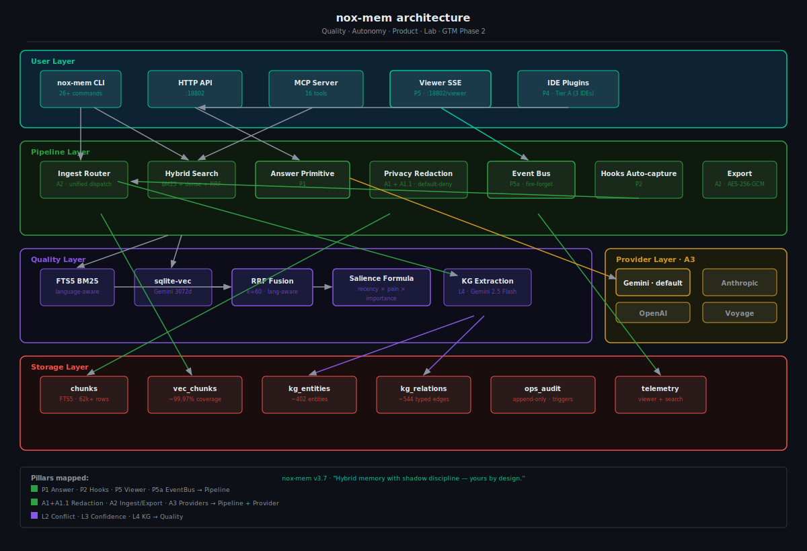
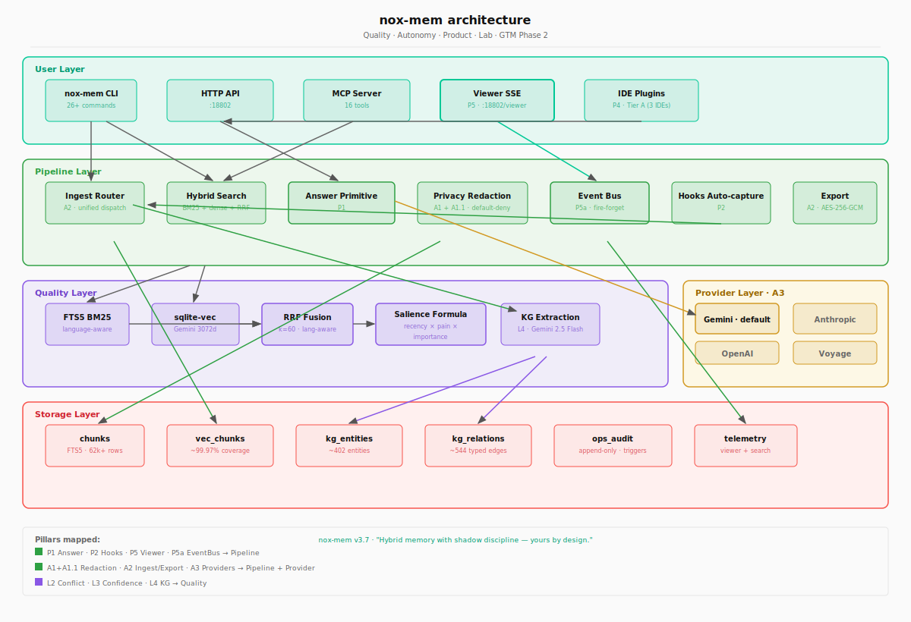

# nox-mem Architecture

> *"Pain-weighted hybrid memory with shadow discipline — yours by design."*

This document describes the complete architecture of nox-mem, mapping the five layers, the Q/A/P/Lab/GTM pillar assignments, the data flow through the system, and the failure modes that each pillar guards against.

**Canonical diagram sources:**
- Mermaid: `docs/architecture/diagram.mmd`
- SVG dark: `docs/architecture/diagram-dark.svg`
- SVG light: `docs/architecture/diagram-light.svg`

**Cross-links:**
- Threat model → `SECURITY.md` + `staged-privacy/` (A1)
- Roadmap → `docs/ROADMAP.md`
- Decisions → `docs/DECISIONS.md` (D40, D41, D36–D39)
- Vision → `docs/VISION.md` (v15)

---

## Overview

nox-mem is a five-layer hybrid memory system. Reading from top to bottom:

```
User Layer       — CLI / HTTP API / MCP / Viewer / IDE plugins
Pipeline Layer   — Ingest · Search · Answer · Privacy · EventBus · Export
Quality Layer    — FTS5 · sqlite-vec · RRF · Salience · KG
Storage Layer    — chunks · embeddings · kg_entities · kg_relations · audit · telemetry
Provider Layer   — Gemini (default) · OpenAI · Anthropic · Voyage
```

Traffic always flows **top-down**. The User Layer is the only entry point into the system; the Storage Layer is the only persistence boundary. The Provider Layer is optional and replaceable — the system degrades gracefully when no provider API key is available (zero-vendor mode, A4).

---

## Layer Details

### User Layer

Five surfaces, each with a distinct integration model:

| Surface | Protocol | Pillar | Notes |
|---|---|---|---|
| `nox-mem CLI` | stdin/stdout | core | 26+ commands; entry point is `dist/index.js` |
| HTTP API `:18802` | HTTP/JSON | core | REST + SSE; Chrome squats :18800 — never move |
| MCP Server | JSON-RPC | core | 16 tools; Claude Code / Codex / Cursor integration |
| Viewer SSE | SSE → browser | P5 | Vanilla JS/CSS/HTML, <50KB, served at `/viewer/` |
| IDE Plugins | HTTP + MCP | P4 Tier A | Deep integrations: Claude Code, Codex, Cursor |

The Viewer surface (P5) is unique because it is a **pull** consumer via `EventSource` — the browser holds a long-lived HTTP connection to `/api/events/stream` and receives events as they happen. All other surfaces are request/response.

### Pipeline Layer

Eight components handle ingest, retrieval, and cross-cutting concerns:

**Ingest Router (A2):** `src/lib/ingest-router.ts` — single dispatch point (`routeIngest()`) that detects entity files vs flat markdown vs graphify input and routes to the correct handler. Callers are agnostic of file type. The guard inside `ingestFile()` is the safety net if the router is bypassed.

**Hybrid Search:** Orchestrates the three-stage retrieval: FTS5 BM25 → Gemini semantic → RRF fusion. Language-aware since E14 (Wave 1). Called by CLI, HTTP API, MCP, and Answer Primitive. Emits to Event Bus on every execution.

**Answer Primitive (P1):** Wraps Hybrid Search + Confidence field (L3) + Provider to construct a cited, grounded answer to a natural-language question. The primitive returned by `nox-mem answer` — not a chat UX, a composable function.

**Privacy Redaction (A1 + A1.1):** Two-layer default-deny policy applied to every event before it leaves the pipeline. Layer 1 (per-kind mapping in `instrumentation.ts`) removes sensitive fields at construction. Layer 2 (`stripForbiddenFields`) is a recursive defensive sweep that catches anything that sneaked through layer 1. Fields never surfaced: chunk content/body, embeddings, raw query text, raw KG entity names, API keys, absolute paths.

**Event Bus (P5a):** `src/lib/events/bus.ts` — fire-forget `EventEmitter` singleton. `emitAsync` schedules listeners via `setImmediate`, ensuring the bus **never blocks** the DB write or response path. Budget: <100µs overhead per emit.

**Hooks Auto-capture (P2):** Claude Code session hooks that automatically ingest every completed session into nox-mem chunks without manual `nox-mem ingest`. The path that makes adoption zero-friction.

**Export + Portability (A2 extended):** Produces encrypted portable snapshots (AES-256-GCM + scrypt KDF) from chunks + embeddings + KG + audit. Plaintext option via `--unencrypted`. The guarantee: you can always get your data out, regardless of what happens to the service.

**Temporal Queries (P3):** Parses natural-language time references ("what did I decide about X last week?") and maps them to chunked time-bounded searches. Depends on Hybrid Search + `kg_relations` for entity-anchored temporal lookups.

### Quality Layer

Six components responsible for retrieval quality and knowledge enrichment:

**FTS5 BM25:** SQLite FTS5 full-text index on `chunks`. Language-aware query expansion added in E14 (Wave 1, 2026-05-17). FTS5 vanilla AND-strict semantics mean complex NL queries can return zero results — always compare against Hybrid (combined nDCG=0.699 vs FTS alone=0.000 in eval baseline).

**sqlite-vec (dense retrieval):** Vector index on `vec_chunks`, 3072-dimensional Gemini embeddings. Coverage: ~99.97% (62.9k chunks). The `trg_chunks_delete_cascade` trigger keeps vectors in sync with chunk deletes.

**RRF Fusion:** Reciprocal Rank Fusion with k=60 merges FTS5 and dense rankings. Language-aware variant (E14) adjusts weights based on detected query language. This is the ranking heart — any change to RRF requires shadow-mode baseline before shipping (D38, D39 decision history).

**Salience Formula:** `salience = recency × pain × importance` — exposed on `/api/health.salience`. Currently in shadow-mode (`NOX_SALIENCE_MODE=shadow`). Used to surface "what matters most right now" rather than "what is most textually similar." Pain field ranges 0.1 (trivial) to 1.0 (prod-outage).

**KG Extraction (L4):** Gemini 2.5 Flash extracts typed `(entity, relation, entity)` triples from ingested chunks nightly (incremental). Produces `kg_entities` (~402) and `kg_relations` (~544 typed edges). Used by Conflict Detection (L2) and temporal queries.

**Conflict Detection (L2) / Confidence (L3):** Lab features gated on KG relations. L2 flags contradictory edges (`kg_relations`). L3 attaches a confidence score to chunk-level claims. Both require gate metrics before integrating into ranking — see `docs/DECISIONS.md` D38–D39.

### Storage Layer

Seven tables, all in a single SQLite file (`nox-mem.db`):

| Table | Purpose | Key constraints |
|---|---|---|
| `chunks` + `chunks_fts` | Primary memory store | FTS5 virtual table; `section`, `pain`, `retention_days` schema v10 |
| `vec_chunks` + `vec_chunk_map` | Dense vector index | sqlite-vec; cascade delete via trigger |
| `kg_entities` | KG node store | ~402 entities; `name_hash` indexed |
| `kg_relations` | KG edge store | FK to `kg_entities.id` — NOT inline strings (common gotcha) |
| `ops_audit` | Destructive operation log | Append-only; DELETE + terminal-UPDATE blocked by triggers (CWE-693) |
| `viewer_telemetry` | SSE client session log | Migration v20; `ts_end IS NULL` = active clients |
| `search_telemetry` | Query log for eval | 4 extra columns since 2026-04-25 (A0 extension) |

**Critical invariants** checked every 15 minutes by `check-schema-invariants.sh`:
- `section NOT NULL` for entity-file chunks
- `feedback` type chunks have `retention_days IS NULL` (never-decay)
- `ops_audit` has no rows with invalid status enum
- `section_boost` consistent with `section` value

### Provider Layer (A3)

Abstract provider interface lets you swap the embedding + LLM vendor with a single env var change. Gemini is default because Gemini 3072d embeddings produce the best retrieval quality in current benchmarks.

| Provider | Role | Default? |
|---|---|---|
| Gemini (`gemini-2.5-flash-lite`) | Embeddings (3072d) + KG extraction + Answer | Yes |
| OpenAI | Embeddings fallback | No |
| Anthropic | Answer Primitive fallback | No |
| Voyage | Embeddings alternative | No |

**Hard rules:**
- Never use `gemini-2.0-flash` (deprecated, shutdown 2026-06-01)
- Never use `gemini-2.5-flash` for agent-infra tasks (quota 3M/d estoura) — use `flash-lite`
- Zero-vendor mode (A4): CI must pass with no API keys, using mocks + fixtures

---

## Pillar Mapping

Every feature in nox-mem belongs to one of the five strategic pillars: Q (Quality), A (Autonomy), P (Product), Lab, or GTM Phase 2.

### Quality (Q) — "numbers that lead"

| Pillar ID | Component | Layer |
|---|---|---|
| Q1 | LoCoMo benchmark harness | Quality + eval/ |
| Q2 | LongMemEval harness | Quality + eval/ |
| Q3 | Latency p95 instrumentation | Pipeline + Storage |
| Q4 | COMPARISON.md head-to-head | docs/ |

Quality features affecting ranking ALWAYS go through shadow-mode (minimum 1 week baseline). Scoring changes use prefix `tune(search):` or `feat(search):` — never `fix`. Boost is additive, never multiplicative.

### Autonomy (A) — "data is yours, completely"

| Pillar ID | Component | Layer |
|---|---|---|
| A1 + A1.1 | Privacy Redaction | Pipeline |
| A2 | Ingest Router + Export + Portability | Pipeline |
| A3 | Provider abstraction | Provider |
| A4 | Zero-vendor CI validation | Pipeline + Provider |

The invariant for all Autonomy pillars: the SQLite file is yours. No daemon, no cloud, no vendor required to read your own data.

### Product (P) — "memory that shows up where you work"

| Pillar ID | Component | Layer |
|---|---|---|
| P1 | Answer Primitive | Pipeline |
| P2 | Hooks Auto-capture | Pipeline |
| P3 | Temporal Queries | Pipeline |
| P4 Tier A | IDE Plugins (Claude Code, Codex, Cursor) | User |
| P5 | Viewer SSE (real-time) | User + Pipeline |
| P5a | Event Bus (fire-forget) | Pipeline |

P5 + P5a form the observable memory surface — the only place where the full data flow is visible in real time.

### Lab — 40% capacity, gated graduation

| Pillar ID | Component | Layer |
|---|---|---|
| L2 | Conflict Detection | Quality |
| L3 | Confidence Field | Quality |
| L4 | KG Extraction improvements | Quality |

Lab features require explicit gate metrics before touching ranking. Failures are recorded publicly in `docs/DECISIONS.md` (e.g., D36, D38, D39).

### GTM Phase 2 — gated on Q4 COMPARISON winning

Asset production and open-source rampup: README hero, COMPARISON table, 30s install demo, banner + stat SVGs. Starts shipping only after Q4 delivers.

---

## Data Flow Narrative

A complete ingest-to-retrieval cycle:

**1. Ingest (user writes a file to `memory/entities/`)**
```
inotifywait → watcher
  → Ingest Router (A2) detects entity file
  → ingestEntityFile() produces N+2 chunks (frontmatter + compiled + timeline)
  → Privacy Redaction (A1) sweeps each chunk
  → chunks table ← section + pain + retention_days populated
  → KG Extraction (L4) runs async: kg_entities + kg_relations updated
  → Vectorize: Gemini 3072d embedding → vec_chunks
  → Event Bus (P5a) emits "chunk.created" → Broadcaster → SSE clients
  → Viewer shows event card in <500ms
```

**2. Search (user runs `nox-mem search "X"`)**
```
CLI → Hybrid Search
  → Stage 1: FTS5 BM25 query → ranked list (language-aware)
  → Stage 2: Gemini embedding of query → sqlite-vec cosine search
  → Stage 3: RRF Fusion (k=60) merges both rankings
  → Salience weighting applied (shadow-mode)
  → Results returned + telemetry written
  → Event Bus emits "search.executed" → Viewer card
```

**3. Answer (user runs `nox-mem answer "Q"`)**
```
HTTP API → Answer Primitive (P1)
  → Hybrid Search fetches top-K candidates
  → Confidence (L3) scores each candidate (gated)
  → Provider (Gemini via A3) generates grounded answer with citations
  → Answer + citations returned
```

---

## Failure Mode Mapping

Where each layer's gaps could cause data loss, regression, or security issues:

| Risk | Pillar gap | Mitigation |
|---|---|---|
| Ranking regression shipping silently | Any scoring change bypassing shadow-mode | `tune(search):` prefix convention + D38 rule; 1-week shadow gate |
| Entity file chunks losing `section`/`retention_days` | A2 ingest-router bypassed | Guard in `ingestFile()` + `check-schema-invariants.sh` every 15min |
| Destructive op without snapshot | Missing `withOpAudit()` wrapper | `ops_audit` append-only table + pre-op VACUUM INTO snapshot |
| Sensitive data leaking via SSE stream | A1 redaction gap | Two-layer defense: per-kind mapping + `stripForbiddenFields` sweep |
| Provider key rotated mid-session | A3 provider abstraction | Key in `.env` only; `set -a; source .env; set +a` before any CLI |
| Vector coverage drift | `vec_chunks` not updated | `trg_chunks_delete_cascade` trigger + `/api/health.vectorCoverage` canary |
| KG relations queried with inline strings | Schema misconception | FK to `kg_entities.id` — integer join, not inline string (documented bug history) |
| Viewer token in nginx access log | `?token=` query string auth | Log filter for `?token=` path; prefer `Authorization: Bearer` header |
| Concurrent writes with WAL stale | Direct `cp snapshot.db` restore | Use `safeRestore()` from `src/lib/op-audit.ts`; validates `user_version` match |

---

## Diagram

Dark variant (for README/dark GitHub):



Light variant (for docs/print):



Mermaid source for interactive rendering: `docs/architecture/diagram.mmd`

To render locally:
```bash
# Install mermaid CLI
npm install -g @mermaid-js/mermaid-cli

# Render dark
mmdc -i docs/architecture/diagram.mmd -o docs/architecture/diagram-rendered.svg \
  --backgroundColor "#0d1117" --theme dark

# Render light
mmdc -i docs/architecture/diagram.mmd -o docs/architecture/diagram-light-rendered.svg \
  --backgroundColor "#fafafa" --theme default
```

---

*Generated 2026-05-18 · nox-mem v3.7 · Q/A/P architecture (D40 pivot)*
