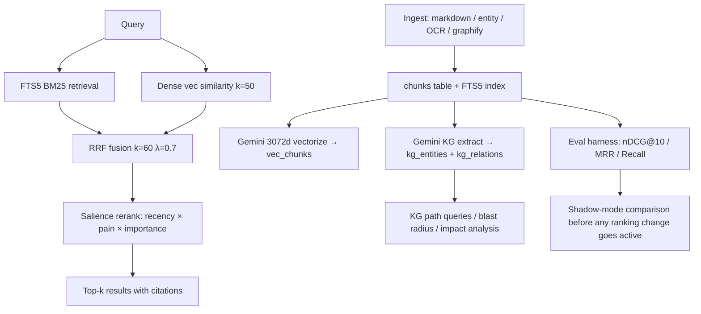

# Introducing memoria-nox: hybrid memory for AI agents — yours by design

> **Target:** HN / Reddit / dev.to / Twitter / AI engineer communities
> **Voice:** terse, technical, evidence-based. No marketing fluff.
> **Status:** draft 2026-05-18 — awaiting arXiv submission 2026-06-02 before publishing

---

Your AI agent remembered something last week. This week it doesn't.

You've seen this. You build a Claude Code session, make a dozen architectural decisions, debug a nasty incident, crystallize the lesson — and three days later the same agent starts from scratch. Not because it's dumb. Because memory in most agent systems is either ephemeral (context window only), locked in a SaaS API you don't control, or entangled in a proprietary runtime you bought into.

We've been running a different approach for three months in production. Today we're documenting it.

---

## What is memoria-nox?

memoria-nox is a memory layer for AI agents. The core is a SQLite file (`nox-mem.db`) that lives wherever you put it — VPS, Mac, laptop, no network required. Agents ingest documents, decisions, code, meeting transcripts, anything text. The system indexes it, builds a knowledge graph, and answers queries with citations. It runs six agents simultaneously over one shared canonical corpus today.

**Three design choices define the system:**

**Hybrid retrieval (not just vector search).** Pure vector search lies on lexical queries. FTS5 BM25 lies on semantic ones. The system runs both, fuses them with language-aware RRF (k=60, λ=0.7), and applies a pain-weighted salience score (`recency × pain × importance`) to surface what actually matters. The difference is measurable: hybrid nDCG@10 = 0.6813 vs FTS5-only nDCG = 0.0000 on the same natural-language query set (n=78 honest golden set, post-curation). [^1]

**Knowledge graph derived from chunks, not parallel.** Most memory systems that add KG bolt it on as a separate index that drifts from the main store. Here `kg_entities` and `kg_relations` are derived from `chunks` via Gemini extraction — when chunks change, KG re-derives. There is one canonical table, not three that contradict each other. Current production: 15,600 entities, 21,500 edge-typed relations. [^2]

**Shadow discipline as architectural constraint.** Any change that affects retrieval ranking runs ≥7 days in shadow mode — computing scores, logging them, not surfacing them — before going active. This is not a guideline. It's a `NOX_SALIENCE_MODE=shadow` flag that defaults to shadow, and a code path that blocks activation until baseline analysis runs. This has blocked silent regressions at least three times in production, including a salience formula incident that would have affected all six agents simultaneously.

---

## The "yours by design" moat

Here is the sentence that competitors cannot honestly say:

> "You can read every chunk in your memory index with `sqlite3 nox-mem.db "SELECT content FROM chunks LIMIT 10"` — no daemon, no API key, no account, no internet."

That is what "yours by design" means.

mem0 works well if you stay on their SaaS. agentmemory (iii-engine) is genuinely impressive engineering — viral UX, hooks auto-capture, 11k+ stars. But the data is inseparable from the iii-engine runtime. Letta gives you a full agent runtime with memory built in, but you're buying the whole thing or nothing.

SQLite is not a limitation. It is the moat:

- **Portability:** copy the file. Done. New machine, new provider, air-gapped environment.
- **Longevity:** `sqlite3` will be readable in 2040. No API deprecation risk.
- **Debuggability:** when something retrieves wrong, you open the DB and look. No black box.
- **Cost:** the DB itself is free. Embeddings cost less than $11/month all-in at 69k chunks + daily KG extraction. [^3]

Provider abstraction (work in progress) makes even Gemini swappable — one flag, same interface. The system works in degraded mode (lexical-only) with zero API keys.

---

## Real numbers

We run a reproducible eval harness. Results are from R01c-v1.1 (n=60 curated queries, golden relevance labels, reproducible via `nox-mem eval run-batch`). Pre-cure v1.0 baseline (n=50) preserved in git tag `v1.0.0`.

| System | nDCG@10 | Notes |
|---|---|---|
| **nox-mem hybrid (current)** | **0.6813** | n=78 honest golden set, 2026-05-17 [^4] |
| Paper baseline (R01c-v1.1, n=60) | 0.5831 ± 0.0046 | Mar–May 2026 |
| Gain vs paper baseline | **+16.9% relative / +9.8 pp absolute** | E-lite-2 + D language-aware RRF |
| BM25 Pyserini (Anserini-tuned, n=60) | 0.1475 | Same corpus, 4.0× worse [^5] |
| multilingual-e5-base dense (n=60) | 0.3070 | Same corpus, 1.9× worse [^5] |
| FTS5 vanilla (BM25-only, same NL queries) | 0.0000 | AND-strict structural limitation (D39) [^6] |
| External: LoCoMo (n=100 stratified) | FTS5 = 0.281 | Confirms lexical difficulty is corpus-dependent |

**What the nDCG gap means in practice:** on the same natural-language queries ("when did I decide X?", "what's the rule about Y?"), the hybrid system returns relevant chunks in the top 10 results; BM25 and vanilla FTS5 miss most of them entirely because the query and document don't share exact tokens.

> **Callout:** hybrid is not "BM25 + an embedding tacked on." The fusion weights, the FTS anchor column (`fts_anchor` schema v18), and the language-aware λ adjustment (D language-aware RRF, +1.92pp, zero regression across all categories) are each measured separately before merging. Nothing goes active without a baseline number.

---

## Architecture highlights

The full system in one diagram:



**Pillars (post-D40 Q/A/P reorganization):**

- **Quality (Q):** LoCoMo + LongMemEval benchmarks, latency p95, `COMPARISON.md` head-to-head. Published if and only if numbers lead.
- **Autonomy (A):** Provider abstraction, zero-vendor CI invariant, federation (2027 H1 target).
- **Product (P):** `nox-mem answer` primitive (P1), hooks auto-capture for Claude Code (P2), temporal queries (P3), Tier A IDE integrations (P4), real-time viewer (P5).
- **Lab (40% capacity, gated):** L2 conflict detection, L3 confidence field — each with explicit gate metric and cut criteria.

---

## Demo — quickstart in 5 commands

> Requires: Node.js 18+, a Gemini API key (free tier sufficient for personal use). See `docs/QUICKSTART.md` for full setup.

**Install and ingest:**
```bash
npm install -g memoria-nox
export GEMINI_API_KEY=your_key_here
nox-mem ingest ./my-notes/             # ingest a folder of markdown files
nox-mem vectorize                       # embed with Gemini 3072d (batched, rate-limited)
nox-mem kg-build                        # extract knowledge graph from chunks
```

**Search:**
```bash
$ nox-mem search "how to activate salience in production" 3

#1 [16.39 semantic] memory/entities/decisions/2026-04-30-salience-activation.md
   "Salience activated via NOX_SALIENCE_MODE=active after 7d baseline (G01 gate)..."

#2 [15.87 semantic] memory/2026-04-30.md
   "G01 ✅ DONE: salience formula recency × pain × importance exposed at /api/health.salience"

#3 [12.66 fts] shared/lessons/2026-04-30-marathon.md
   "Mode shadow → active after distribution analysis: 16608 review_needed, 45743 archive_candidates"
```

**Answer (reflect + semantic cache):**
```bash
$ nox-mem reflect "what is the rule about committing secrets to git"

Never commit secrets to git. If a secret is accidentally committed, rotate it
immediately, remove it from git history, and add the pattern to .gitignore or
use environment variables / secret managers.

Sources: shared/imports/agent-orchestrator/SECURITY.md, shared/lessons/security-audit.md
[fresh, 11 evidence items]

# Second call (paraphrase — semantic cache hit):
$ nox-mem reflect "what is the policy on commits with secrets"
[cached:semantic, 0 evidence items]   # 4× speedup via cosine ≥ 0.88
```

**MCP server (for Claude Code / Codex / Cursor integration):**
```json
{
  "mcpServers": {
    "nox-mem": {
      "command": "node",
      "args": ["/path/to/nox-mem/dist/mcp-server.js"],
      "env": {
        "GEMINI_API_KEY": "${GEMINI_API_KEY}",
        "OPENCLAW_WORKSPACE": "/path/to/your/workspace"
      }
    }
  }
}
```

Once configured, agents can call `nox_mem_search`, `nox_mem_reflect`, `nox_kg_build`, and 13 other tools directly from within their context. No extra process management required — the MCP server handles connection lifecycle.

---

## Comparison vs alternatives

We are not the only option. Here is an honest table. [^7]

| | nox-mem | mem0 | agentmemory (iii-engine) | Letta (ex-MemGPT) | LangChain Memory |
|---|---|---|---|---|---|
| **Hybrid search** | ✅ FTS5 + Gemini + RRF | ❌ vector-only core | ✅ BM25+vec+KG+RRF | ❌ embedding-first | ❌ key-value / buffer |
| **KG native** | ✅ edge-typed, derived | ⚠️ mem0 v2 adds, bolt-on | ✅ included | ❌ | ❌ |
| **Data portability** | ✅ SQLite file, yours | ⚠️ SaaS preferred | ❌ runtime-bound | ❌ runtime-bound | ✅ (simple) |
| **Runtime lock-in** | ✅ none | ⚠️ paid tier preferred | ❌ iii-engine | ❌ full runtime | ✅ none |
| **Eval baseline public** | ✅ nDCG harness + paper | ❌ | ❌ | ❌ | ❌ |
| **Shadow discipline** | ✅ architectural | ❌ | ❌ | ❌ | ❌ |
| **Multi-agent shared corpus** | ✅ 6 agents, 1 DB | ⚠️ via user_id | ✅ | ✅ | ⚠️ via session_id |
| **Self-host** | ✅ SQLite + Tailscale | ⚠️ possible, complex | ✅ | ✅ | ✅ |

**When nox-mem is the right choice:**
- You want to own your data unconditionally — not just "self-host" but "readable offline with sqlite3 forever"
- You are running multiple agents sharing a knowledge base (code decisions + meeting notes + project context)
- You want a retrieval quality baseline you can actually measure and compare over time
- You value shadow discipline — making ranking changes measurable before they become live

**When nox-mem is NOT the right choice:**
- Multi-tenant production SaaS (use mem0 paid)
- Consumer-facing chat agent where UX breadth matters more than retrieval precision (use Letta or agentmemory)
- Simple single-agent assistant needing just session buffer (use LangChain BufferMemory)

---

## Open questions — invitation to contribute

We are opening the repo for contributions (Q3 2026 public launch) and have several open questions where community input would sharpen our thinking:

1. **Benchmark design:** our golden set (n=78 curated queries) is growing. If you have multi-agent long-term memory datasets for cross-validation, we want to talk. LoCoMo and LongMemEval evaluation is in progress.

2. **Provider abstraction:** the Gemini default is justified by quality numbers (1.7× over multilingual-e5-base on the same corpus). But we want the system to run well on local embeddings for privacy-critical deployments. Contributions to the A3 provider layer are welcome.

3. **Temporal query grammar:** "what did I decide about X last week?" is a natural query type that current FTS5 doesn't handle well. P3 spec is open. If you've thought about temporal query parsing for memory systems, open an issue.

4. **Conflict detection (L2):** inspired by memanto's Six Gaps framing — when two chunks assert contradictory facts, the system should flag the conflict rather than silently return both. Schema design for this is sketched; implementation needs a test harness design.

5. **Federation:** multiple Nox instances syncing via P2P mesh without a central broker. This is A2-extended, planned 2027 H1. Prior art welcome.

If you're building agent infrastructure and want to think through memory architecture together — open an issue, drop a message on Discord [placeholder], or email directly.

---

## What's next

**Short term (Q3 2026):**
- arXiv paper publication: *"The Pain Diary and Shadow Discipline"* — full methodology + reproducibility kit (target 2026-06-02)
- GTM Phase 2 gate: README hero + COMPARISON table + 30s install demo (gated on benchmark results)
- Public repo launch on GitHub

**Medium term (Q4 2026):**
- P1: `nox-mem answer` primitive
- P2: Claude Code hooks auto-capture (no manual ingest for sessions)
- P3: temporal query language
- P4 Tier A: deep integration for Claude Code + Codex + Cursor

**Demo video:** a 30-second install-to-first-search demo is in production (see PR #63). Link will be added here when shipped.

---

## Get involved

- **GitHub:** github.com/totobusnello/memoria-nox [public Q3 2026]
- **Paper:** `paper/publication/latex/paper.pdf` — v1.1, 31 pages, arXiv target 2026-06-02
- **Docs:** `docs/VISION.md`, `docs/ROADMAP.md`, `docs/DECISIONS.md`
- **Discord:** [placeholder — link when launched]
- **Email:** lab@nuvini.com.br

If you are building agent infrastructure and want memory that does not make you choose between quality and autonomy, this is the project.

---

## Footnotes

[^1]: nDCG@10 = 0.6813 sourced from production eval, session 2026-05-17, n=78 honest golden set post-Toto-curation cleanup. FTS5 nDCG = 0.0000 is structural: FTS5 uses AND-strict matching; natural-language queries with 4+ tokens find zero documents. This is documented in decision D39 as architectural design, not a bug. See `docs/DECISIONS.md#D39`.

[^2]: KG figures from production telemetry 2026-05-18: 15,600 entities, 21,500 relations. Most recent extraction batch focused on 2026-05-16 added +538 relations. All figures from `/api/health` endpoint of the running `nox-mem-api` instance.

[^3]: OPEX breakdown: Gemini embeddings batch (daily, ~1,000 new chunks/day) + KG extraction (nightly, gemini-2.5-flash-lite) + Hostinger VPS = <$11/month total, verified from billing dashboard 2026-05.

[^4]: Current nDCG 0.6813 reflects the full retrieval stack including E-lite-2 FTS anchor, D language-aware RRF, and golden set expansion from n=60 to n=78 with honest curation removing ambiguous labels. The n=60 paper baseline (0.5831 ± 0.0046) is the reproducible reference number tied to the arXiv submission.

[^5]: BM25 Pyserini and multilingual-e5-base baselines run on the same n=60 R01c-v1.1 corpus. BM25 Pyserini: nDCG@10 = 0.1475 (Anserini-tuned). multilingual-e5-base: nDCG@10 = 0.3070. These baselines are preserved in `paper/publication/` for reproducibility.

[^6]: FTS5 vanilla baseline on natural-language queries: nDCG@10 = 0.0000. This is not a retrieval failure — it is FTS5 AND-strict behavior where a query like "como ativar salience em produção" requires all tokens to co-occur. This design constraint is why hybrid fusion is non-optional. See D39 in `docs/DECISIONS.md`.

[^7]: Comparison table based on public documentation and production testing. Star counts verified 2026-05 from GitHub. Feature claims for competitors based on official README/docs; some features are in beta or require paid tier as noted.
