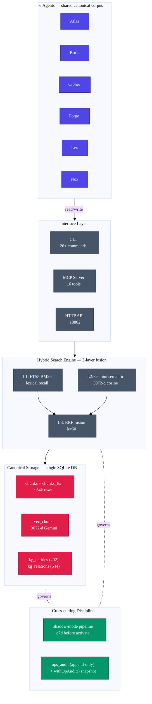
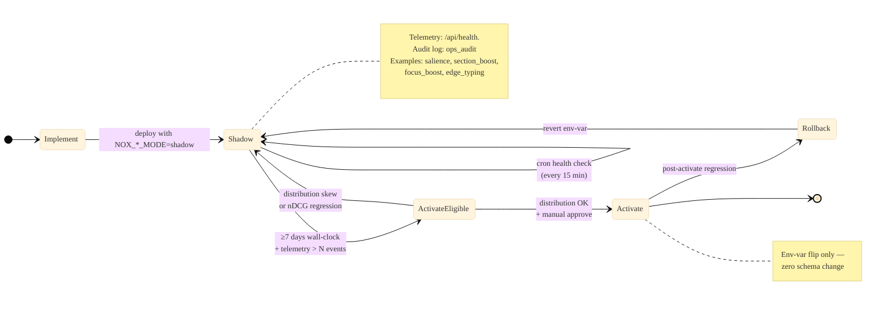
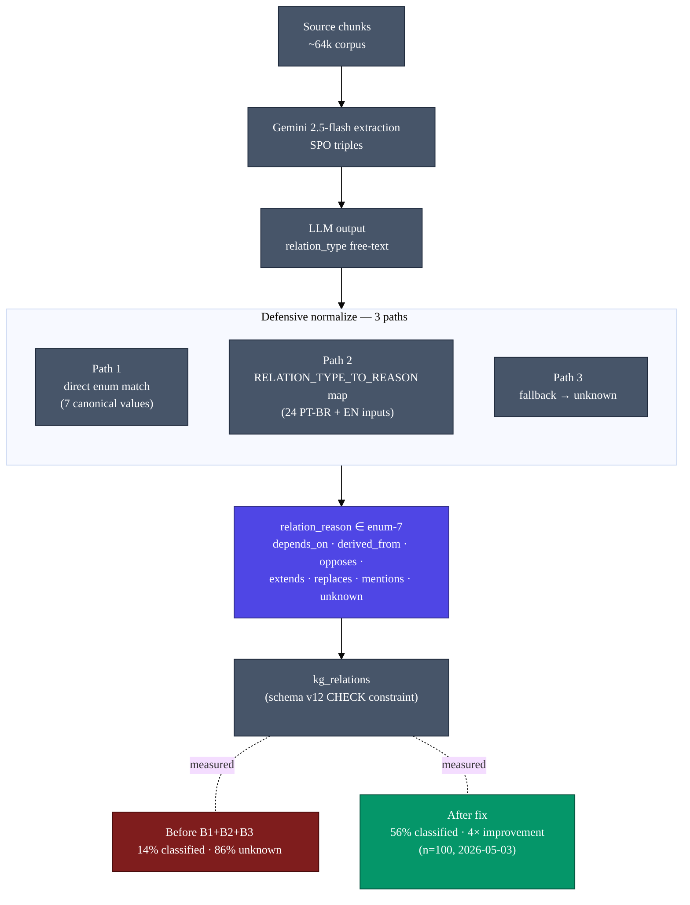

# NOX-Supermem — System Architecture (Paper Figures)

Source-of-truth for figures referenced in `paper/publication/04-paper-arxiv-draft.md` §3 and `05-blog-post-draft.md`. All four diagrams are renderable standalone in mermaid.live.

Color convention (high-contrast, accessible):
- **Indigo `#4F46E5`** — agents / consumers
- **Slate `#475569`** — neutral infrastructure (interfaces, storage)
- **Amber `#D97706`** — *pain* dimension (contribution #1)
- **Emerald `#059669`** — *shadow-mode* discipline (contribution #2)
- **Rose `#E11D48`** — *shared canonical* corpus (contribution #3)
- White text on dark fills throughout (WCAG AA).

---

## Figure 1 — System Overview (HERO)

**[Figure 1: System overview.]** Six personas read and write through a unified interface layer (CLI / MCP / HTTP) into a single canonical SQLite corpus (rose) — no per-agent silos. Retrieval runs as a three-layer hybrid (BM25 → 3072-d Gemini cosine → RRF, k=60). The shadow-mode pipeline and append-only `ops_audit` (emerald) are cross-cutting governance: every ranking change ships shadow first; every destructive op is wrapped by `withOpAudit()` snapshot.

---

## Figure 2 — Salience Pipeline (pain dimension highlighted)

```mermaid
%%{init: {'theme':'base','themeVariables':{'fontSize':'14px','fontFamily':'Inter, system-ui'}}}%%
flowchart LR
    INGEST["File ingest<br/>(watcher / CLI / MCP)"]
    ROUTER["ingest-router<br/>entity / md / graph"]
    ANNOT["Annotate<br/>retention_days · section · pain"]
    COMPUTE["Compute salience<br/>recency × pain × importance"]
    SHADOW["Shadow-mode<br/>NOX_SALIENCE_MODE=shadow<br/>≥7 days telemetry"]
    GATE{{"Activate gate<br/>distribution + nDCG OK?"}}
    APPLIED["Applied to ranking<br/>RRF post-fusion boost"]

    INGEST --> ROUTER --> ANNOT --> COMPUTE --> SHADOW --> GATE
    GATE -- yes --> APPLIED
    GATE -- no --> SHADOW

    classDef base fill:#475569,stroke:#1E293B,color:#fff
    classDef pain fill:#D97706,stroke:#92400E,color:#fff
    classDef shadow fill:#059669,stroke:#064E3B,color:#fff
    classDef gate fill:#0F172A,stroke:#000,color:#fff

    class INGEST,ROUTER,APPLIED base
    class ANNOT,COMPUTE pain
    class SHADOW shadow
    class GATE gate
```

**[Figure 2: Salience pipeline.]** Each chunk is annotated at ingest with three signals — `retention_days` (typed lifetime), `section` (compiled / frontmatter / timeline), and **pain** (0.1 trivial → 1.0 prod-outage, amber). Salience = `recency × pain × importance` is computed and exposed via `/api/health.salience` for at least seven days before any activation. The activate gate inspects distribution shape and nDCG@10 deltas; failure loops back to shadow. Pain is the novel axis — recency and importance are common in prior work; a domain-validated severity multiplier is the contribution.

---

## Figure 3 — Shadow Discipline State Machine

**[Figure 3: Shadow discipline.]** Every ranking-affecting change traverses this machine. Activation requires three independent signals: at least seven days of shadow telemetry, a healthy distribution (no degenerate clustering), and explicit human approve. Regression at any point reverts via a single environment-variable flip — zero schema rollback ever required. Validated end-to-end on Phase 1.7b-b salience, G02 section_boost (1,578 events analysed), E03a SPO injection, E04a focus boost, and E05 edge typing.

---

## Figure 4 — KG Edge Typing Flow (closed-enum + defensive normalize)

**[Figure 4: KG edge typing flow (E05).]** Gemini emits free-text relation labels; a defensive three-path normaliser collapses them into a closed enum of seven canonical reasons enforced by a schema-v12 `CHECK` constraint. The annotated before/after captures the lesson: an LLM-optional enum field combined with the prompt clause *"use unknown if unsure"* drove 86% of relations into `unknown`. The fix — code-side defensive map (24 PT-BR + EN aliases) plus a revised prompt — lifted classification from 14% → 56% (4×) on n=100. A closed enum without a defensive normaliser is half a feature.
