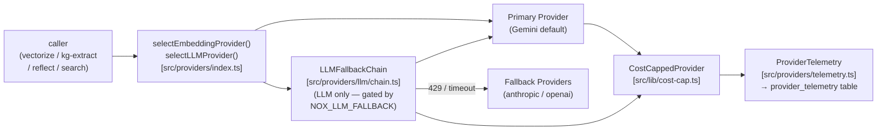

# Provider Abstraction Layer (A3)

**Pillar:** A (Autonomy) — *"Your memory. Your provider. Your bill. No middlemen."*

> **D41 lock:** Gemini is the default for both embeddings and LLM. Swapping providers is opt-in only. With zero env overrides, behavior is byte-identical to the pre-A3 main branch.

---

## Overview

A3 introduces a pluggable provider layer so you can run nox-mem with:

- **Gemini** (default, highest retrieval quality per E14)
- **OpenAI** embeddings or LLM (stub in V1, real in A3.1)
- **Anthropic** LLM (stub in V1, real in A3.1)
- **Voyage** embeddings (stub in V1, real in A3.1)
- **Local** (Ollama / llama.cpp via OpenAI-compatible shim, experimental)

No code changes required to swap — a single env var is enough.

---

## Architecture



**Embedding calls do NOT go through the fallback chain.** Mixing embedding providers mid-corpus silently corrupts semantic search (different vector spaces). Only LLM calls are chainable.

---

## Provider matrix

| Provider | Embedding | LLM | Default dim | V1 status | Cost / 1M tokens (in) |
|---|---|---|---|---|---|
| **Gemini** | gemini-embedding-001 | gemini-2.5-flash-lite | 3072 | **Real** | $0.15 / $0.10 |
| OpenAI | text-embedding-3-small | gpt-4o-mini | 1536 | Stub (A3.1) | $0.02 / $0.15 |
| Anthropic | — (no public API) | claude-3-5-haiku | — | Stub (A3.1) | — / $0.80 |
| Voyage | voyage-3 | — | 1024 | Stub (A3.1) | $0.06 / — |
| Local | any (OpenAI-compat) | any (OpenAI-compat) | varies | Experimental | varies |

**Status: Real** = tested, production-ready.
**Status: Stub** = interface conformance only, throws `NotImplementedError` on actual calls. Activate after A3.1 wires the real implementation.

---

## Configuration (env vars)

All env vars have safe defaults. With zero overrides, behavior is Gemini-only (D41).

### Provider selection

| Env var | Default | Values | Effect |
|---|---|---|---|
| `NOX_EMBEDDING_PROVIDER` | `gemini` | `gemini` \| `openai` \| `voyage` | Select embedding provider |
| `NOX_LLM_PROVIDER` | `gemini` | `gemini` \| `openai` \| `anthropic` | Select LLM provider |
| `NOX_EMBEDDING_MODEL` | *(provider default)* | any model id | Override model for embedding calls |
| `NOX_LLM_MODEL` | `gemini-2.5-flash-lite` | any model id | Override LLM model (**explicit only**; see CLAUDE.md regra #3) |

### API keys

| Env var | Required when |
|---|---|
| `GEMINI_API_KEY` | `NOX_EMBEDDING_PROVIDER=gemini` or `NOX_LLM_PROVIDER=gemini` (default) |
| `OPENAI_API_KEY` | `NOX_EMBEDDING_PROVIDER=openai` or `NOX_LLM_PROVIDER=openai` (A3.1) |
| `ANTHROPIC_API_KEY` | `NOX_LLM_PROVIDER=anthropic` (A3.1) |
| `VOYAGE_API_KEY` | `NOX_EMBEDDING_PROVIDER=voyage` (A3.1) |
| `NOX_LOCAL_BASE_URL` | `NOX_EMBEDDING_PROVIDER=local` or `NOX_LLM_PROVIDER=local` |

### Fallback chain (LLM only)

| Env var | Default | Effect |
|---|---|---|
| `NOX_LLM_FALLBACK` | *(unset)* | Comma-separated fallback chain: `anthropic:claude-3-5-haiku,openai:gpt-4o-mini` |

When unset: primary-only mode (no fallback). Fallback is opt-in for LLM calls only.

### Cost cap

| Env var | Default | Effect |
|---|---|---|
| `NOX_PROVIDER_DAILY_USD_CAP` | `50.00` | Daily spend cap in USD (resets at UTC midnight) |
| `NOX_PROVIDER_DAILY_USD_CAP_BYPASS` | *(unset)* | Set to `1` to bypass cap (writes audit row, never silent) |

### Health checks

| Env var | Default | Effect |
|---|---|---|
| `NOX_PROVIDER_HEALTH_FAIL_FAST` | `1` | `0` = soft-warn on health failure; `1` = throw at boot |

---

## Cost model

Costs are estimated from `PRICE_TABLE_USD_PER_1M_INPUT` in `src/lib/cost-cap.ts` using:

```
cost_usd = (tokens_in / 1_000_000) × price_in + (tokens_out / 1_000_000) × price_out
```

Prices are public list prices as of 2026-05. **Actual invoice may differ** (batch discounts, free tier, etc.). Reconcile monthly vs provider invoice — auto-pull is A3.2.

The daily cap is global across all callers (per-caller subcap is A3.2).

---

## Fallback strategy

```
NOX_LLM_FALLBACK=anthropic:claude-3-5-haiku,openai:gpt-4o-mini
```

Retry / fallback policy:
1. **Primary timeout** (default 30s) → try next provider in chain.
2. **HTTP 429** (rate limit) → mark primary 60s cooldown, try next.
3. **HTTP 401 / 403** (auth) → **fail-fast**, no fallback. This is a user config bug.
4. **All fail** → throw last error (secrets redacted from message).

`CompleteResult.providerId` indicates which provider actually served the request so telemetry attributes correctly.

**Embeddings are never chained.** Swapping the embedding provider mid-corpus corrupts search — use A3.1 `nox-mem reembed` to migrate. Set `NOX_EMBEDDING_PROVIDER` only after reembedding the full corpus.

---

## Migration guide (15 refactor sites)

See `staged-A3/edits/REFACTOR-SITES.md` for the full site-by-site migration plan.

### Quick reference pattern

```typescript
// Before (pre-A3 direct call):
import { geminiClient } from '../lib/gemini-client.js';
const result = await geminiClient.generate({ prompt });

// After (A3 provider abstraction):
import { selectLLMProvider } from '../providers/index.js';
const llm = selectLLMProvider();   // reads NOX_LLM_PROVIDER env; defaults to gemini
const result = await llm.complete({ user: prompt });
```

Migration order: T13.a (embedder, vectorize) → T13.b (KG, reflect, crystallize, heartbeat) → T13.c (search hot path).

### Backward compatibility

- With zero env overrides, factory returns Gemini providers — identical to pre-A3.
- Direct calls to deprecated `geminiClient` emit one-time process warning after T13.
- Old exports kept for one minor version then removed.

---

## Recovery scenarios

### Rate limit (HTTP 429)

With fallback chain active (`NOX_LLM_FALLBACK` set):
- Primary enters 60s cooldown automatically.
- Requests route to first fallback.
- Primary recovers at next call after cooldown expires.

Without fallback chain (default):
- Error propagates to caller.
- Caller should implement exponential backoff.
- Increase `NOX_PROVIDER_DAILY_USD_CAP` if cap is being hit due to 429 retries.

### Quota exceeded (daily spend cap)

```bash
# Emergency bypass (logged to ops_audit):
NOX_PROVIDER_DAILY_USD_CAP_BYPASS=1 nox-mem <command>

# Check today's spend:
curl http://127.0.0.1:18802/api/health | jq '.cost.last24h'

# Raise cap:
export NOX_PROVIDER_DAILY_USD_CAP=100.00
```

### Network failure

`healthCheck()` includes a 5s timeout. If a provider is down at boot:
- `NOX_PROVIDER_HEALTH_FAIL_FAST=0` → soft-warn, continue with degraded service.
- `NOX_PROVIDER_HEALTH_FAIL_FAST=1` (default) → throw `ProviderHealthError` at startup.

### API key rotation

```bash
# 1. Update .env
sed -i 's/GEMINI_API_KEY=.*/GEMINI_API_KEY=<new_key>/' /root/.openclaw/.env

# 2. Reload env + verify health
set -a; source /root/.openclaw/.env; set +a
curl http://127.0.0.1:18802/api/health | jq '.providers'
```

---

## Adding a new provider

1. **Implement the interface** in `src/providers/embedding/<name>.ts` or `src/providers/llm/<name>.ts`.
2. **Register** in `src/providers/index.ts`:
   - Add to `KNOWN_EMBEDDING_PROVIDERS` or `KNOWN_LLM_PROVIDERS`.
   - Add `case "<name>":` to the factory switch.
3. **Write conformance tests** in `__tests__/conformance-extended.test.ts` — the 12-case battery must pass.
4. **Add to provider matrix** in this file.
5. **Add to runbook** `runbooks/A3-provider-smoke.md`.

Stubs are welcome as V1 entries — implement `healthCheck()` returning `ok=false` with a clear message, and throw `NotImplementedError` from the work method. Real impl comes in A3.1.

---

## Security notes

- **API keys are env-only.** Never hardcode in source. Never commit to git.
- **Keys are never logged.** `redactSecrets()` applied to all error messages before surfacing. Error text matches `AIza*`, `sk-*`, `Bearer *`, `key=*` patterns and replaces with `<REDACTED>`.
- **`CostCapExceededError` contains only numbers.** Prompt content never appears in the error message.
- **Telemetry rows store no prompt text.** Only: provider_id, model, kind, token counts, cost, latency, ok, caller, session_id.
- **Bypass requires explicit env var** (`NOX_PROVIDER_DAILY_USD_CAP_BYPASS=1`) and writes an audit row — never silent.

---

## D41 reaffirmation

> *Gemini is the default provider for both embeddings and LLM. Swapping providers is opt-in only. E14 empirically validated that Gemini-embedding-001 (3072d) + RRF outperforms all alternatives tested on the nox-mem eval set. Any provider swap on the embedding path requires A3.1 `nox-mem reembed` to avoid silent retrieval corruption.*

*Decision recorded: `docs/DECISIONS.md` §D41 (2026-05-17).*

---

*Last updated: 2026-05-18 (A3 T9-T16 wave-b delivery).*
