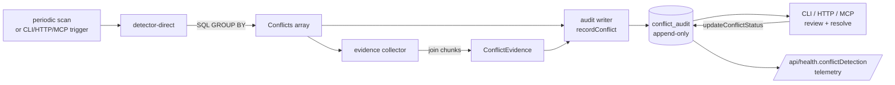

# L2 — KG Conflict Detection

> *"Pain-weighted hybrid memory with shadow discipline — yours by design."*
>
> Lab capability turning memanto's Gap #5 ("contradictions silently coexist")
> into a structural differentiator on nox-mem's KG substrate. Shadow-first,
> append-only, no auto-mutation of `kg_relations` in v1.

**Status:** L2 T1-T12 implemented (Wave C, 2026-05-18).
**Owner:** Toto (decisão) · Maestro (execução).
**Spec canônico:** `specs/2026-05-17-L2-conflict-detection.md`.
**Cross-link:** CLAUDE.md regra #5 (shadow ≥7d) · CLAUDE.md regra #6 (append-only audit).

---

## 1. Overview

memoria-nox stores knowledge as a typed knowledge graph: entities (typed
nodes) + relations (typed edges with predicate, confidence, evidence chunk,
extraction method, supersession chain). When two relations make competing
claims about the same `(subject, predicate)` axis — for example
`(toto, uses_model, opus-4.6)` vs `(toto, uses_model, sonnet-4.6)` — the
graph contains a **contradiction**. memanto detects these at the text level
via embedding similarity + NLI; we detect them at the relation level via
`O(N)` SQL `GROUP BY`.

The L2 module adds:

1. An **additive schema migration** (`v21-conflict-audit.sql`) introducing
   the `conflict_audit` ledger — append-only, triggers enforce immutability
   of raw conflict data.
2. A **detector** (`detector-direct.ts`) computing Type 1 (direct
   contradictions) deterministically from `kg_relations`.
3. An **evidence collector** (`evidence.ts`) joining each variant to its
   originating chunk for human review.
4. An **audit writer** (`audit-writer.ts`) recording detected conflicts
   and tracking their resolution lifecycle.
5. A **shadow-mode wrapper** (`shadow.ts`) gating the entire surface
   behind `NOX_CONFLICT_MODE` (default `disabled`).
6. **CLI, HTTP and MCP surfaces** for analyst review and resolution.
7. A **scheduler scaffold** for nightly cron operation.

v1 ships **Type 1** (direct contradictions) end-to-end. Types 2 (logical
mutual exclusion), 3 (temporal supersession) and 4 (transitive) are
deferred to L2.1+, with hooks already in place for Type 3 (the schema
carries `superseded_by_relation_id` from v19).

---

## 2. Why this is a differentiator

memanto's Gap #5 framing implies contradictions must be detected *despite*
flat chunk storage — which forces embeddings + NLI + threshold tuning.
That implementation gets paraphrase, negation and hedge polarity wrong
in ways that are hard to debug.

Our substrate is structurally richer:

- 15.646+ entities (typed nodes).
- 21.533+ relations (typed edges with FK to chunks via `evidence_chunk_id`).
- `(subject, predicate)` is a natural primary axis — contradiction is one
  SQL `GROUP BY` away.

Because everything is structured, contradictions are **provable**, not
guessed:

```sql
SELECT source_entity_id, predicate, COUNT(DISTINCT target_entity_id) AS variants
FROM kg_relations
WHERE confidence >= 0.5
  AND superseded_by_relation_id IS NULL
GROUP BY source_entity_id, predicate
HAVING variants > 1;
```

No NLI model. No threshold tuning. No probabilistic false positives from
paraphrase. Where memanto guesses, we prove.

---

## 3. Architecture



Key invariants:

- Detector is **read-only** on `kg_relations`.
- Writer touches **only** `conflict_audit` (and only its mutable columns).
- Triggers enforce append-only semantics at the DB layer (CWE-693 mitigation).
- Modes (`disabled` / `shadow` / `active`) are evaluated once per pass and
  override-able for tests + emergency rollback.

---

## 4. Type 1 detection algorithm

### 4.1 SQL skeleton

```sql
WITH active AS (
  SELECT id, source_entity_id, predicate, target_entity_id, confidence,
         extraction_method, evidence_chunk_id, created_at
  FROM kg_relations
  WHERE confidence >= :min_conf
    AND superseded_by_relation_id IS NULL
)
SELECT source_entity_id,
       predicate,
       COUNT(DISTINCT target_entity_id) AS distinct_targets,
       GROUP_CONCAT(id) AS relation_ids_csv
FROM active
GROUP BY source_entity_id, predicate
HAVING COUNT(DISTINCT target_entity_id) > 1
```

Complexity: O(N) over active relations. With `idx_kg_relations_subject_predicate`
(planned partial index where `superseded_by IS NULL`) the grouping is index-
backed and the v1 SLO target of <30s at 100k relations is met.

### 4.2 Variant hydration

For each conflict, the detector emits a per-variant snapshot:

```typescript
interface VariantRelation {
  relation_id: number;
  target_entity_id: number;
  target_label?: string;             // joined from kg_entities.name
  confidence: number;
  extraction_method?: ExtractionMethod | null;
  evidence_chunk_id?: number | null;
  created_at: number;                // epoch_ms
  user_marked?: boolean;             // immutable per spec §6.3
}
```

### 4.3 Extraction-method bias (optional)

Callers can pass `extraction_method_weights` to bias the displayed
confidence — for example, treat regex-extracted facts as more deterministic
than LLM-extracted ones:

```typescript
detectDirectConflicts(db, {
  extraction_method_weights: { regex_only: 1.1, gemini_only: 0.9 }
});
```

Weights are multiplicative and clamped to `[0, 1]` to respect the schema
CHECK constraint range. They do NOT alter the SQL filter — they only adjust
the surface confidence shown to analysts.

### 4.4 Confidence threshold gate

`min_confidence` defaults to 0.5 (spec §3, regra de ouro #4). Lower values
surface more candidates at the cost of false-positive load on the analyst.
The threshold is enforced in SQL (via parameter) so the index can be used.

---

## 5. Schema additions (v21)

The `v21-conflict-audit.sql` migration is **additive**: it neither alters
existing tables nor changes existing rows. Rolling back to v19 is a single
`DROP TABLE` + index/trigger drops.

```sql
CREATE TABLE conflict_audit (
  id                   INTEGER PRIMARY KEY AUTOINCREMENT,
  ts                   INTEGER NOT NULL DEFAULT (strftime('%s','now')*1000),
  kind                 TEXT NOT NULL CHECK (kind IN
                         ('direct','temporal_supersede','value_drift','multi_target')),
  subject_entity_id    INTEGER NOT NULL,
  predicate            TEXT NOT NULL,
  target_relation_ids  TEXT NOT NULL,    -- JSON array
  variants             TEXT,             -- JSON array (variant snapshots + evidence)
  status               TEXT NOT NULL DEFAULT 'open' CHECK (status IN
                         ('open','reviewed','resolved_pick_one',
                          'resolved_both_valid','resolved_merged','dismissed')),
  resolved_by          TEXT,
  resolved_at          INTEGER,
  resolution_kind      TEXT CHECK (resolution_kind IN
                         ('pick_one','both_valid','merged','dismissed') OR resolution_kind IS NULL),
  picked_relation_id   INTEGER,
  merge_target         TEXT,
  notes                TEXT,
  shadow_mode          INTEGER NOT NULL DEFAULT 1
);

CREATE INDEX idx_conflict_audit_status_ts        ON conflict_audit(status, ts DESC);
CREATE INDEX idx_conflict_audit_subject_predicate ON conflict_audit(subject_entity_id, predicate);
CREATE INDEX idx_conflict_audit_open             ON conflict_audit(status) WHERE status = 'open';
```

### 5.1 Append-only triggers

Three triggers enforce CWE-693 mitigation (mirror of `ops_audit` pattern,
CLAUDE.md regra #6):

| Trigger | Operation | Behavior |
|---|---|---|
| `trg_conflict_audit_no_delete` | DELETE | Unconditional ABORT |
| `trg_conflict_audit_immutable_data` | UPDATE OF kind/subject/predicate/target_relation_ids/variants/ts | ABORT — raw data is immutable |
| `trg_conflict_audit_no_reopen` | UPDATE OF status | ABORT when transitioning OUT of a terminal status |

Mutable columns: `status`, `resolved_by`, `resolved_at`, `resolution_kind`,
`picked_relation_id`, `merge_target`, `notes`, `shadow_mode`.

### 5.2 Idempotency

All `CREATE TABLE` / `CREATE INDEX` / `CREATE TRIGGER` statements use
`IF NOT EXISTS`. Re-applying `v21-conflict-audit.sql` on an already-
migrated DB is a no-op. The `PRAGMA user_version = 21;` line is set
unconditionally — re-application stays on 21.

---

## 6. Configuration (env vars)

| Variable | Default | Effect |
|---|---|---|
| `NOX_CONFLICT_MODE` | `disabled` | One of `disabled`/`shadow`/`active`. Unknown → `disabled`. |
| `NOX_CONFLICT_SCAN_CRON` | `0 3 * * *` | Cron expression (v1 supports only `M H * * *`). |
| `NOX_MCP_ALLOW_WRITES` | unset | When `1`, `conflict_resolve` MCP tool accepts writes. |

Mode semantics:

- **`disabled`** — no detection, no writes, no telemetry. `runConflictPass`
  returns synthetic `{mode:'disabled', detected:0, recorded:0}`. CLI scan
  explicitly upgrades to `shadow` because explicit operator invocation
  counts as opt-in (documented).
- **`shadow`** — detect + record, `shadow_mode=1` on every new row. The
  `annotateRelations` API returns an empty Set (no surface annotation).
- **`active`** — same as shadow + `shadow_mode=0` on new rows. `annotateRelations`
  marks relation ids that appear in open audit rows so callers can render
  a "⚠ conflicting info" badge.

The 7-day shadow baseline (CLAUDE.md regra #5) is gated externally — the
operator examines `/api/health.conflictDetection.counts` over a week before
flipping `NOX_CONFLICT_MODE=active` and restarting nox-mem-api.

---

## 7. CLI usage

```bash
# scan + record
nox-mem conflict scan
nox-mem conflict scan --min-confidence 0.7
nox-mem conflict scan --predicate uses_model --predicate has_status

# list
nox-mem conflict list                    # default status=open
nox-mem conflict list --status dismissed --limit 50
nox-mem conflict list --json             # machine-readable

# show one
nox-mem conflict show 42
nox-mem conflict show 42 --json

# resolve — analyst picks canonical relation
nox-mem conflict resolve 42 --pick 110 --notes "opus is current"

# resolve — analyst merges into a new target (audit-only; v1 doesn't mutate kg_relations)
nox-mem conflict resolve 42 --merge "claude-opus-4.6" --notes "rename consolidation"

# resolve — both targets are legitimately correct (multi-role entity)
nox-mem conflict resolve 42 --both-valid --notes "primary + secondary owner"

# dismiss as false positive
nox-mem conflict resolve 42 --dismiss --notes "predicate misclassified — see kg-predicate-aliases"
```

Exit codes:

- `0` — success
- `1` — usage error (missing arg, invalid flag)
- `2` — runtime error (not found, trigger violation, etc.)

---

## 8. HTTP API

Mounted on `nox-mem-api` at port `:18802`. All responses JSON.

### `GET /api/conflict?status=open&limit=20`

Lists audit rows. `status` accepts any of the six valid status values
(default `open`). `limit` is bounded `[1, 500]` (default 20).

Response:

```json
{
  "count": 3,
  "rows": [
    {
      "id": 42,
      "ts": 1747500000000,
      "kind": "direct",
      "subject_entity_id": 1,
      "predicate": "uses_model",
      "target_relation_ids": [110, 111],
      "variants": [...],
      "status": "open",
      "resolved_by": null,
      "resolved_at": null,
      "resolution_kind": null,
      "picked_relation_id": null,
      "merge_target": null,
      "notes": null,
      "shadow_mode": 1
    }
  ]
}
```

### `GET /api/conflict/:id`

Returns one row + hydrated evidence (chunks joined per variant).

```json
{
  "row": { ... },
  "evidence": {
    "conflict_subject_entity_id": 1,
    "predicate": "uses_model",
    "variants": [
      {
        "variant": {...},
        "chunks": [
          {
            "chunk_id": 5000,
            "snippet": "We switched the primary to opus on 2026-05-01",
            "full_length": 87,
            "ts": 1747400000000,
            "source_session_id": "...",
            "chunk_confidence": 0.8,
            "provenance_kind": "observed"
          }
        ],
        "weighted_score": 0.85
      }
    ]
  }
}
```

### `POST /api/conflict/:id/resolve`

Body:

```json
{
  "kind": "pick_one" | "both_valid" | "merged" | "dismissed",
  "picked_relation_id": 110,
  "merge_target": "claude-opus-4.6",
  "notes": "..."
}
```

Validation:

- `kind=pick_one` requires `picked_relation_id`
- `kind=merged` requires non-empty `merge_target`
- Other kinds reject unknown body fields

Errors:

- `400` — invalid kind / missing required field / invalid type
- `404` — conflict id not found
- `409` — DB trigger rejection (e.g. reopen attempt)

---

## 9. MCP tools

Three tools registered under the nox-mem MCP server:

```
conflict_scan(min_confidence?, predicate_allowlist?, mode_override?)
conflict_list(status?, limit?)
conflict_resolve(id, kind, picked_relation_id?, merge_target?, notes?, actor?)
```

`conflict_resolve` is a **write tool** — gated by `NOX_MCP_ALLOW_WRITES=1`.
Without the env, the tool returns:

```json
{
  "ok": false,
  "error": "mcp_write_disabled",
  "detail": { "hint": "set NOX_MCP_ALLOW_WRITES=1 to enable MCP write tools" }
}
```

This matches the existing pattern for other write tools (`crystallize`,
`reflect_writeback`, etc.).

---

## 10. Periodic scanner

The scheduler scaffold (`scheduler.ts`) is **not actually scheduled** by
this module — it provides decision functions for the daemon (nox-mem-api)
to call from a periodic tick. Default: nightly at 03:00 BRT, after
`backup-all.sh 02:00`. The cron expression is parsed by a strict v1 parser
that only accepts the form `M H * * *`. More complex patterns are rejected
at parse time (no silent silly behavior).

```typescript
import { runScheduledScan } from "nox-mem-conflict/scheduler";

const state = loadStateFromDisk();  // { lastRunAt: number | null }
const result = runScheduledScan(db, {
  cronExpr: process.env.NOX_CONFLICT_SCAN_CRON,
  lastRunAt: state.lastRunAt,
  now: Date.now()
});
if (result.ran) {
  state.lastRunAt = result.result!.scanned_at;
  saveStateToDisk(state);
}
```

The `lastRunAt` cursor is owned by the caller (file, DB row, in-memory
singleton — whatever fits the daemon). The scheduler is idempotent: same
`(now, lastRunAt)` input always yields the same decision.

---

## 11. Shadow-mode rollout plan

Hard requirement from CLAUDE.md regra crítica #5 (ranking changes shadow ≥7d).

### Phase 0 — schema (D-0)
- Apply `v21-conflict-audit.sql` (with `withOpAudit` snapshot)
- Set `NOX_CONFLICT_MODE=disabled` in `.env`
- Restart nox-mem-api
- Validate `pragma_user_version=21`

### Phase 1 — shadow detection (D+0 to D+7)
- Set `NOX_CONFLICT_MODE=shadow` in `.env`
- Restart nox-mem-api
- Nightly scan opt-in: add `runScheduledScan` to daemon tick loop
- `/api/health.conflictDetection` exposes `{mode, last_scan_at, counts}`
- Manual review of any `status=open` rows via CLI / HTTP
- **Gate check D+7:** ≥90% precision on 50 cured pairs (per spec §10), no
  nDCG@10 regression in R01a baseline, conflict volume <100 unresolved

### Phase 2 — active mode (D+7+)
- Flip `NOX_CONFLICT_MODE=active`
- Restart nox-mem-api
- P1 answer pipeline starts surfacing `conflict_flag` annotations on
  retrieved relations (callers consume `annotateRelations`)
- Continue monitoring `/api/health.conflictDetection` for 7 days post-flip

### Rollback path

Set `NOX_CONFLICT_MODE=disabled` + restart. No DB mutation needed.
The `conflict_audit` rows remain (append-only) and are simply ignored by
the runtime. Reapply mode later without re-detecting (existing rows pick
up where they left off).

---

## 12. Roadmap to Type 2/3/4

| Type | Definition | Status | Required hooks |
|---|---|---|---|
| **1** | (subj, pred) → multiple distinct targets | ✅ v1 | `detector-direct.ts` |
| **2** | Two predicates declared mutually exclusive | 🔮 L2.1 | predicate-exclusion registry (config) |
| **3** | Temporal supersession (same axis, newer wins) | 🟡 v1 gated | `kg_relations.created_at` from v19 — implementation deferred |
| **4** | Indirect / transitive contradictions across hops | 🔮 L2.2 | multi-hop reasoner |

### Type 3 hooks already present

Schema v19 added the columns needed for Type 3: `created_at` on
`kg_relations`, `superseded_by_relation_id` FK, `superseded_at`,
`superseded_reason`. The detector's `Conflict.kind` union already includes
`temporal_supersede` and the audit table accepts it. Implementation
requires:

1. A predicate registry of "temporal-natured" predicates (e.g. `has_status`,
   `is_running_version`).
2. A second detector pass that filters Type 1 results down to predicates
   in that registry + applies a recency-vs-confidence rule.
3. A separate `withOpAudit('kg-conflict-supersede', ...)` wrapper for any
   eventual mutation of `kg_relations.superseded_by_relation_id` — which
   v1 explicitly does NOT do.

---

## 13. Testing strategy

Test counts per task:

| Task | File | Tests |
|---|---|---|
| T1 — migration | `__tests__/migration.test.ts` | 5 |
| T2 — types | `__tests__/types.test.ts` | 7 |
| T3 — detector | `__tests__/detector-direct.test.ts` | 13 |
| T4 — evidence | `__tests__/evidence.test.ts` | 8 |
| T5 — audit-writer | `__tests__/audit-writer.test.ts` | 10 |
| T6 — shadow | `__tests__/shadow.test.ts` | 11 |
| T7 — CLI | `cli/__tests__/conflict.test.ts` | 12 |
| T8 — HTTP | `api/__tests__/conflict.test.ts` | 8 |
| T9 — MCP | `mcp/tools/__tests__/conflict.test.ts` | 6 |
| T10 — scheduler | `__tests__/scheduler.test.ts` | 7 |
| T11 — integration | `__tests__/integration.test.ts` | 13 |
| **Total** | | **100** |

### Run from package root

```bash
cd staged-L2
npm install
npm test
```

Tests use an in-memory `FakeDB` (see `__tests__/fakes.ts`) — no external
dependencies. The real production wiring uses better-sqlite3 directly;
the FakeDB exposes only the shape the conflict modules touch, so a new
SQL query must add a matching branch (fail-loud-on-unsupported pattern).

### Integration test coverage (13 tests)

`integration.test.ts` builds a synthetic KG with 5 known conflicts + 50
non-conflict relations + chunks. It then asserts:

1. Exact conflict count (5).
2. Recording yields exactly 5 audit rows.
3. Second scan yields 5 dedupe hits, 0 new rows.
4. Resolving 2 → next scan inserts 2 new rows + dedupes 3 (correct behavior:
   resolved subjects can re-flag on new evidence).
5. Trigger blocks reopening terminal rows.
6. Evidence joins chunks for every variant.
7. `annotateRelations` returns flags only in active mode.
8. `statusCounts` reports mixed terminal/open mix correctly.
9. Confidence threshold gates noise.
10. Limit caps results at boundary.
11. Predicate blocklist on `uses_model` zeros conflicts.
12. Full lifecycle audit row → terminal → counted in stats.

---

## 14. Operational safety

### Regras de ouro (iron laws)

1. **Shadow-first**: default `NOX_CONFLICT_MODE=disabled`. No detection runs
   unless explicitly enabled.
2. **No auto-resolution**: v1 NEVER mutates `kg_relations`. All resolution
   is recorded in `conflict_audit` (append-only).
3. **Append-only audit**: DB triggers prevent DELETE on `conflict_audit`
   and prevent UPDATE on raw data columns.
4. **Confidence threshold gate**: `min_confidence` default 0.5 — don't
   surface low-confidence noise.
5. **PT-BR**: "você" não "tu".

### Threat model — quick check

| Risk | Mitigation |
|---|---|
| Audit tampering | DB triggers (CWE-693) |
| Terminal-row reopen | `trg_conflict_audit_no_reopen` |
| Detector spamming dashboard | `min_confidence` floor + dedupe in writer |
| Shadow flip without baseline | Documented gate check; operator responsibility |
| `kg_relations` corruption | v1 never writes to `kg_relations` |
| MCP unauthorized write | `NOX_MCP_ALLOW_WRITES=1` gate |
| Stale `lastRunAt` | Scheduler is decision-only; caller owns persistence |

### Recovery

If telemetry shows runaway conflict volume after flipping to `active`:

```bash
# 1. Flip back to disabled
sed -i 's/^NOX_CONFLICT_MODE=.*/NOX_CONFLICT_MODE=disabled/' /root/.openclaw/.env
systemctl restart nox-mem-api

# 2. Audit rows are intact (append-only); inspect counts
curl -s http://127.0.0.1:18802/api/health | jq .conflictDetection

# 3. Bulk-dismiss confirmed false positives
for id in $(curl -s 'http://127.0.0.1:18802/api/conflict?status=open' | jq '.rows[].id'); do
  curl -s -X POST http://127.0.0.1:18802/api/conflict/$id/resolve \
    -H 'content-type: application/json' \
    -d '{"kind":"dismissed","notes":"bulk dismiss post-rollback"}'
done
```

---

## 15. File map

```
staged-L2/
├── package.json
├── tsconfig.json
└── edits/
    ├── docs/CONFLICT-DETECTION.md            ← this file
    ├── migrations/
    │   ├── v21-conflict-audit.sql            ← T1
    │   └── v21-rollback.sql
    └── src/
        ├── lib/conflict/
        │   ├── types.ts                      ← T2
        │   ├── db.ts                         (interface)
        │   ├── detector-direct.ts            ← T3
        │   ├── evidence.ts                   ← T4
        │   ├── audit-writer.ts               ← T5
        │   ├── shadow.ts                     ← T6
        │   ├── scheduler.ts                  ← T10
        │   └── __tests__/
        │       ├── fakes.ts
        │       ├── types.test.ts
        │       ├── migration.test.ts
        │       ├── detector-direct.test.ts
        │       ├── evidence.test.ts
        │       ├── audit-writer.test.ts
        │       ├── shadow.test.ts
        │       ├── scheduler.test.ts
        │       └── integration.test.ts       ← T11
        ├── cli/
        │   ├── conflict.ts                   ← T7
        │   └── __tests__/conflict.test.ts
        ├── api/
        │   ├── conflict.ts                   ← T8
        │   └── __tests__/conflict.test.ts
        └── mcp/tools/
            ├── conflict.ts                   ← T9
            └── __tests__/conflict.test.ts
```

---

## 16. Production wiring (next session)

This staged package contains all modules but does **not** yet hook into the
production nox-mem-api singleton. Wiring tasks (NOT part of L2 T1-T12):

1. Add `import { dispatchConflictApi } from "./api/conflict.js"` to the
   Express router in nox-mem-api and mount it before the 404 handler.
2. Register MCP tools in the nox-mem MCP server config.
3. Add `conflict` subcommand to the CLI dispatcher in `dist/index.js`.
4. Wire `runScheduledScan` into the daemon tick loop with persistent
   `lastRunAt` storage (suggest a `meta` table or `/var/lib/nox-mem/conflict-scheduler.state.json`).
5. Add `/api/health.conflictDetection` field to the health endpoint.
6. Run `v21-conflict-audit.sql` through `withOpAudit('migrate-v21', ...)`
   with snapshot.
7. Set `NOX_CONFLICT_MODE=shadow` in `.env` and start the 7-day baseline.

---

*Documento gerado durante Wave C overnight 2026-05-18 sob a tagline
"Pain-weighted hybrid memory with shadow discipline — yours by design."*
