# `nox-mem answer` — P1 Answer Primitive

> *Pain-weighted hybrid memory with shadow discipline — yours by design.*

The **answer primitive** turns a natural-language question into a grounded answer plus inline `[chunk_N]` citations. It is the first product surface that lets a caller (CLI, HTTP, MCP) treat the corpus as something queryable beyond raw search.

This doc describes the primitive shipped by **P1 T1–T14** (spec: `specs/2026-05-17-P1-answer-primitive.md`, kickoff: `specs/2026-05-18-P1-implementation-kickoff.md`). Decisions are locked per `docs/DECISIONS.md §D41`.

---

## 1. Overview

| | |
|---|---|
| **What it does** | Take a question, retrieve top-K chunks via hybrid search, prompt the LLM with anti-hallucination guard, parse + validate citations, persist telemetry. |
| **Default model** | `gemini-2.5-flash-lite` (locked, D41 #1 — cost-prioritized) |
| **Surfaces** | CLI (`nox-mem answer`), HTTP (`POST /api/answer`), MCP (`nox_mem_answer` tool) — all share one library code path. |
| **Privacy invariant** | `question_text` is **never** persisted by default; only `question_hash = sha256(question)[:16]`. |
| **Hallucination policy** | If the LLM cites a marker outside the retrieval set, retry **once** with a stricter prompt. If retry still hallucinates, fail with `hallucination_after_retry` (no retry-N loop — kickoff critical decision #3). |
| **Telemetry** | Every call (success + failure) writes one row to `answer_telemetry` (schema v11). |
| **Status codes** | 200 ok / 400 invalid body / 422 hallucination after retry / 502 LLM unreachable / 503 retrieval empty / 504 timeout |

---

## 2. Architecture

```mermaid
flowchart LR
    Q["question (CLI / HTTP / MCP)"] --> A["answer()"]
    A --> R["retrieveContext()<br/>hybrid search<br/>dedupe by content_hash<br/>topK cap<br/>marker_id assigned"]
    R --> P["buildPrompt()<br/>system: anti-halluc<br/>user: question + chunks"]
    P --> L["LLMProvider.complete()<br/>flash-lite default"]
    L --> C["parseCitations()<br/>extract [chunk_N]<br/>validate vs retrieval set"]
    C -- "hallucinated > 0" --> RT["buildRetryPrompt()<br/>STRICT MODE"]
    RT --> L2["LLMProvider.complete()<br/>retry"]
    L2 --> C2["parseCitations() #2"]
    C2 -- "still bad" --> ERR["AnswerError<br/>hallucination_after_retry"]
    C -- "clean" --> T["recordAnswer()<br/>answer_telemetry"]
    C2 -- "clean" --> T
    ERR --> T
    T --> OUT["AnswerResult { answer, citations[], metadata }"]
```



**Single library path.** CLI / HTTP / MCP differ only in how they parse input and shape the response envelope. They all call the same `answer(opts)` function from `src/lib/answer/index.ts`.

**Marker bridge.** The LLM only ever sees opaque markers `chunk_1`..`chunk_N`. Real DB `chunk_id`s never leak into the prompt — they are joined back in by the citation parser after the LLM responds. This is the anti-prompt-injection lock.

---

## 3. CLI usage

```bash
# Happy path
nox-mem answer "What is the salience formula?"

# Top-K + JSON output
nox-mem answer "Which retention default for lessons?" --top-k 12 --json

# Strip inline markers from the rendered text (citations array still present)
nox-mem answer "What is D41?" --no-citations

# Override model via flag (one-off)
nox-mem answer "Provider swap test" --model gemini-2.5-flash

# Override via env (sticky in shell session)
NOX_ANSWER_MODEL=gemini-2.5-flash nox-mem answer "Same as above"

# Mock provider (no real LLM call — useful for plumbing smoke tests)
nox-mem answer "anything" --provider mock
```

**Exit codes:**

| Code | Reason |
|---|---|
| `0` | success |
| `2` | invalid argv (bad flag, missing question, `invalid_input` from lib) |
| `3` | `retrieval_empty` (no chunks matched) |
| `4` | `hallucination_after_retry` (LLM cited unknown markers twice) |
| `5` | `llm_error` / `llm_timeout` |
| `1` | unexpected runtime error |

**Sample output (`--json`):**

```json
{
  "answer": "Salience is defined as recency × pain × importance [chunk_1].",
  "citations": [
    {
      "chunk_id": 5002,
      "marker_id": "chunk_1",
      "file_path": "memory/entities/feedback/salience.md",
      "line_range": "L5-L9",
      "snippet": "Salience formula: salience = recency × pain × importance."
    }
  ],
  "metadata": {
    "latency_ms": 1180,
    "tokens_in": 280,
    "tokens_out": 38,
    "provider": "gemini",
    "model": "gemini-2.5-flash-lite",
    "retrieval_count": 8,
    "fallback_used": false,
    "retry_count": 0
  }
}
```

---

## 4. HTTP usage

```bash
# Basic POST
curl -sS http://127.0.0.1:18802/api/answer \
  -H "Content-Type: application/json" \
  -d '{"question": "What is the salience formula?"}' | jq

# With trace id (joined to telemetry)
curl -sS http://127.0.0.1:18802/api/answer \
  -H "Content-Type: application/json" \
  -H "X-Trace-Id: my-trace-abc" \
  -d '{"question": "What is D41?", "top_k": 5}' | jq

# Strip inline markers
curl -sS http://127.0.0.1:18802/api/answer \
  -H "Content-Type: application/json" \
  -d '{"question": "What is D41?", "no_citations": true}' | jq
```

**Request body (`AnswerRequest`):**

```json
{
  "question": "string, 1-2000 chars (required)",
  "top_k": "integer 1-20 (default 8)",
  "max_tokens": "integer 64-8192 (default 1500)",
  "provider": "'gemini' | 'mock' (default 'gemini')",
  "model": "string (default 'gemini-2.5-flash-lite' per D41 #1)",
  "temperature": "number 0-1 (default 0.2)",
  "no_citations": "boolean (default false)",
  "trace_id": "string ≤64 chars (server generates UUID if omitted)"
}
```

**Response headers:**

- `X-Trace-Id` — echoes inbound or server-generated UUID; joins to `answer_telemetry`.
- `X-Model-Used` — actual model the lib resolved (after env overrides).
- `X-Retry-Count` — `0` or `1` (per kickoff §critical decision #3).
- `Content-Type: application/json`

**Status codes** — see Failure modes table below.

---

## 5. MCP usage

The `nox_mem_answer` tool is exposed alongside the existing 16 MCP tools.

**Tool definition:**

```json
{
  "name": "nox_mem_answer",
  "description": "Answer a question using the nox-mem corpus with grounded citations [chunk_N]. Anti-hallucination guard built-in (retry-once on cited markers not in the retrieval set). Returns JSON: { answer, citations[], metadata } in content[0].text.",
  "inputSchema": {
    "type": "object",
    "required": ["question"],
    "additionalProperties": false,
    "properties": {
      "question": { "type": "string", "minLength": 1, "maxLength": 2000 },
      "top_k": { "type": "integer", "minimum": 1, "maximum": 20, "default": 8 },
      "max_tokens": { "type": "integer", "minimum": 64, "maximum": 8192, "default": 1500 },
      "provider": { "type": "string" },
      "model": { "type": "string" },
      "temperature": { "type": "number", "minimum": 0, "maximum": 1 },
      "no_citations": { "type": "boolean", "default": false }
    }
  }
}
```

**Sample MCP call from Claude Desktop:**

> Use the `nox_mem_answer` tool to find out: what is the default model for the answer primitive?

The tool returns `content[0].text` as a JSON string. Parsers should `JSON.parse(result.content[0].text)` to get `{ answer, citations[], metadata }`.

**Error envelope:**

```json
{
  "content": [
    {
      "type": "text",
      "text": "{\"error\":true,\"reason\":\"hallucination_after_retry\",\"message\":\"...\",\"metadata\":{...}}"
    }
  ],
  "isError": true
}
```

---

## 6. Configuration

### Env vars

| Variable | Default | Effect |
|---|---|---|
| `NOX_ANSWER_MODEL` | `gemini-2.5-flash-lite` | Override LLM model id |
| `NOX_ANSWER_PROVIDER` | `gemini` | Override provider name |
| `NOX_ANSWER_TEMPERATURE` | `0.2` | Override LLM temperature (clamped 0-1) |
| `NOX_ANSWER_TOPK` | `8` | Override top-K retrieval (clamped 1-20) |
| `NOX_ANSWER_MAX_TOKENS` | `1500` | Override output token budget (clamped 64-8192) |
| `NOX_ANSWER_TIMEOUT_MS` | `15000` | LLM call timeout (clamped 1000-120000) |
| `NOX_ANSWER_LOG_QUESTIONS` | unset | If `=1`, persists raw `question` text in `answer_telemetry` (off by default — privacy invariant) |
| `NOX_E2E_GEMINI` | unset | If `=1`, the E2E test suite (`e2e-gemini.test.ts`) calls the real Gemini API |
| `GEMINI_API_KEY` | unset | Required for real API calls |

**Sourcing env on the VPS (CLAUDE.md regra #1):**

```bash
set -a; source /root/.openclaw/.env; set +a
nox-mem answer "anything"
```

Without `set -a`, the CLI exits with `llm_error` because Gemini calls silently fail (no API key in process env).

### Defaults are encoded in `src/lib/answer/config.ts`

The hardcoded defaults are intentional — they should match the locked D41 #1 values. **Do not silently bump the default model to `gemini-2.5-flash`** (CLAUDE.md regra #3 — quota 3M/d estoura). Use the env override or `--model` flag for one-off upgrades.

---

## 7. Failure modes

| `failure_reason` (lib) | CLI exit | HTTP status | DB `failed_reason` (mapped) | Cause | User action |
|---|---|---|---|---|---|
| `retrieval_empty` | `3` | `503` | `NULL` | Hybrid search returned 0 chunks. Lib short-circuits and returns canonical `"I have no memory matches for this question."` | (a) Verify the question keywords match indexed content. (b) Try `--top-k 20` to widen. (c) Run `nox-mem stats` to confirm chunks > 0. (d) If brand-new corpus, run `nox-mem ingest` then retry. |
| `hallucinated_citation` | `4`* | `422`* | `hallucinated_citation` | LLM cited a marker outside `1..N`. Lib retries once internally. | Retry is automatic; no user action unless this surfaces as `hallucination_after_retry`. |
| `hallucination_after_retry` | `4` | `422` | `hallucinated_citation` | Retry STILL cited an unknown marker. Lib gives up per kickoff §critical decision #3 — no retry-N loop. | (a) Inspect retrieval: `nox-mem search "<q>" --top-k 12` — are the chunks relevant? (b) Try a higher-quality model: `--model gemini-2.5-flash` (one-off, costs ~3× more). (c) File an audit if reproducible on a non-adversarial question. |
| `llm_error` | `5` | `502` | `provider_down` | Provider network error (`ETIMEDOUT`, `ECONNREFUSED`, HTTP 5xx, malformed response). | (a) `curl https://generativelanguage.googleapis.com/v1beta/models` — provider up? (b) Check `GEMINI_API_KEY` valid (HTTP 401 surfaces this). (c) If repeats, file incident; consider `NOX_ANSWER_PROVIDER=mock` for plumbing smoke. |
| `llm_timeout` | `5` | `504` | `provider_down` | LLM call exceeded `NOX_ANSWER_TIMEOUT_MS` (default 15s). | (a) Try `--max-tokens 500` (lighter output). (b) Bump `NOX_ANSWER_TIMEOUT_MS=30000` temporarily. (c) Check Gemini status page. |
| `invalid_input` | `2` | `400` | `NULL` | Empty / oversize / wrong-type body. Lib refuses to call the LLM. | Fix the request. The error message identifies the offending field. |
| `unauthorized` | n/a | `401` | n/a | API token middleware rejected the request. | Set `Authorization: Bearer <token>` per `src/api/server.ts` config. CLI/MCP do not enforce auth (local-only). |
| `internal_error` | `1` | `500` | n/a | Unexpected exception in the handler. | File an incident with `X-Trace-Id` from the response header — joins to telemetry row + stderr log. |
| `token_budget` | n/a* | `422`* | `token_budget` | (Reserved for future v2.) Prompt exceeded budget even after lowest-score chunk drop. | v1 always keeps ≥1 chunk; this code is in the schema CHECK for future use. |

\* `hallucinated_citation` (single-hit) does not surface to the caller in v1 — the retry path either succeeds (caller sees `200`) or escalates to `hallucination_after_retry`. The telemetry row distinguishes them via `fallback_used=1`.

---

## 8. Cost model

**Default lane: `gemini-2.5-flash-lite` — $0.10 per 1M input tokens, $0.40 per 1M output tokens** (D41 #1).

Per-call cost estimate, typical query:

| Component | Tokens | Subtotal (USD) |
|---|---|---|
| System prompt | ~150 | ~$0.000015 |
| User prompt (question + 8 chunks × ~80 chars) | ~280 | ~$0.000028 |
| Output (answer + citations) | ~150 | ~$0.000060 |
| **Total** | **~580** | **~$0.0001** |

**At 10,000 calls/day** the daily cost is ~$1. Compare to `gemini-2.5-flash` full at ~$3/day for the same workload — 3× more.

**`answer_telemetry.cost_estimate_usd`** is populated per row from the price table in `src/lib/answer/telemetry.ts`. Aggregate spend via:

```sql
SELECT
  DATE(timestamp_ms / 1000, 'unixepoch') AS day,
  COUNT(*) AS calls,
  ROUND(SUM(cost_estimate_usd), 4) AS usd_total
FROM answer_telemetry
WHERE timestamp_ms > (strftime('%s', 'now', '-7 days') * 1000)
GROUP BY day
ORDER BY day DESC;
```

**Cost guards:**

1. `MAX_TOKENS_TEST = 200` hardcoded in the E2E test suite — total test run < $0.01 even with `npm run test:e2e`.
2. `NOX_ANSWER_MAX_TOKENS` clamped to `[64, 8192]` — no one-shot bomb possible.
3. `top_k` clamped to `[1, 20]` — prompt size bounded.
4. `--provider mock` for plumbing smoke tests — zero LLM spend.

---

## 9. Hallucination retry logic

**Pseudocode** (mirrors `src/lib/answer/index.ts:answer()`):

```ts
const first = await llm.complete(buildPrompt(question, chunks));
const parsed = parseCitations(first.text, chunks);

if (parsed.hallucinated.length === 0) {
  return { answer: first.text, citations: parsed.citations, ... };
}

// One retry with STRICT MODE prompt
const retry = await llm.complete(buildRetryPrompt(question, chunks));
const parsedRetry = parseCitations(retry.text, chunks);

if (parsedRetry.hallucinated.length > 0) {
  throw new AnswerError("hallucination_after_retry", ...);
}

return {
  answer: retry.text,
  citations: parsedRetry.citations,
  metadata: { fallback_used: true, retry_count: 1, ... }
};
```

**Why no retry-N loop:**

1. Latency budget — each retry is one full LLM round-trip (~1s p50 for flash-lite). Retry-N would balloon p95 unboundedly.
2. Signal — if the model hallucinates twice in a row on the *same* retrieval set, the retrieval is probably the problem, not stochasticity. The caller should fix the corpus, not throw more tokens.
3. Cost — retry-N invites accidental DoS via adversarial questions.

**Anti-hallucination prompt difference:**

| | `buildPrompt` (initial) | `buildRetryPrompt` (retry) |
|---|---|---|
| System | "Answer ONLY from the numbered context. Cite EVERY claim with `[chunk_N]`. Never invent." | "**STRICT MODE — your previous answer cited a marker that does not exist.** You MUST only cite markers literally listed below. Do NOT speculate." |
| Tone | Polite guidance | Adversarial — calls out the previous error |
| Empirical effect | Recovers ~85% of stochastic miscitations | Failure path is rare (<0.5% of calls on the canonical fixture) |

---

## 10. Telemetry

**Table:** `answer_telemetry` (schema v11). Columns map 1:1 to `AnswerTelemetryRow` in `src/lib/answer/telemetry.ts`.

```sql
CREATE TABLE answer_telemetry (
  id                  INTEGER PRIMARY KEY AUTOINCREMENT,
  question_hash       TEXT NOT NULL,    -- sha256(question)[:16]
  session_id          TEXT,             -- CLI/HTTP/MCP correlation
  timestamp_ms        INTEGER NOT NULL,
  provider            TEXT NOT NULL,    -- 'gemini' | 'mock' | ...
  model               TEXT NOT NULL,    -- 'gemini-2.5-flash-lite' | ...
  retrieval_count     INTEGER NOT NULL,
  citation_count      INTEGER NOT NULL,
  tokens_in           INTEGER,
  tokens_out          INTEGER,
  latency_ms          INTEGER NOT NULL,
  fallback_used       INTEGER NOT NULL DEFAULT 0,
  failed_reason       TEXT,             -- enum, see below
  cost_estimate_usd   REAL NOT NULL DEFAULT 0,
  CHECK (failed_reason IS NULL OR failed_reason IN
         ('hallucinated_citation', 'provider_down', 'token_budget'))
);
```

**Privacy:** `question_hash` is `sha256(question)[:16]` — irreversible. Raw text is **never** persisted unless `NOX_ANSWER_LOG_QUESTIONS=1` (intended for debugging only; disable within 48h).

**Operator queries:**

```sql
-- p50 / p95 latency over last 24h
SELECT
  ROUND(latency_ms) AS lat_ms,
  COUNT(*) AS n
FROM answer_telemetry
WHERE timestamp_ms > (strftime('%s', 'now', '-24 hours') * 1000)
ORDER BY lat_ms;

-- Citation accuracy (% of clean calls)
SELECT
  COUNT(*) AS total,
  SUM(CASE WHEN failed_reason IS NULL THEN 1 ELSE 0 END) AS clean,
  printf('%.1f%%',
    100.0 * SUM(CASE WHEN failed_reason IS NULL THEN 1 ELSE 0 END) / COUNT(*)
  ) AS accuracy
FROM answer_telemetry
WHERE timestamp_ms > (strftime('%s', 'now', '-7 days') * 1000);

-- Retry rate
SELECT
  fallback_used,
  COUNT(*) AS calls
FROM answer_telemetry
WHERE timestamp_ms > (strftime('%s', 'now', '-7 days') * 1000)
GROUP BY fallback_used;

-- Failure mode distribution
SELECT
  COALESCE(failed_reason, 'success') AS outcome,
  COUNT(*) AS calls
FROM answer_telemetry
WHERE timestamp_ms > (strftime('%s', 'now', '-7 days') * 1000)
GROUP BY failed_reason
ORDER BY calls DESC;

-- Model distribution (verify flash-lite is dominant per D41)
SELECT model, COUNT(*) AS calls
FROM answer_telemetry
WHERE timestamp_ms > (strftime('%s', 'now', '-7 days') * 1000)
GROUP BY model;
```

---

## 11. Roadmap (deferred from this sprint)

The following items were scoped out of P1 T1–T14 and live in the followup queue:

| Item | Rationale for deferral | Owner / next sprint |
|---|---|---|
| **T15 — Golden Q/A eval harness** (15-30 pairs, citation accuracy %) | Requires curated corpus pairs; gated on Q4 LongMemEval scaffolding (separate Lab spec) | Lab — Q3 |
| **T16 — Cache layer** (memo by `question_hash + retrieval_signature`) | v1 measures latency without cache to expose real cost. Add bounded LRU if p95 misses target consistently post-deploy. | Q (Quality) — Q2 |
| **T17 — `--shadow` mode** (run pipeline, persist telemetry, return `{ok:true,shadow:true}`) | Used in A/B testing of prompt/model changes. Not needed for v1 ship. | Q — Q2 |
| **T18 — Multi-provider fallback chain** (`flash-lite → flash → opus`) | Currently `flash-lite → fail (HTTP 502)`. Opus is gated behind `NOX_ANSWER_FALLBACK_OPUS=1` env. Auto-chain risks silent cost blowups; revisit after baseline telemetry is in. | A (Autonomy) — Q3 |
| **T19 — Streaming responses** (`Server-Sent Events` on `POST /api/answer?stream=1`) | Cosmetic UX — v1 round-trip is <2s p95 which is acceptable for non-streaming. | P (Product) — Q3 |
| **T20 — `/api/health.answerMetrics`** aggregator | Trivial follow-up; SQL view + JSON serializer over the queries in §10. | Q — Q2 fast-follow |
| **T21 — Per-tool MCP analytics** (which agent calls `nox_mem_answer` most?) | Requires session attribution upstream of MCP. Wait for P5 viewer-realtime to land session context. | P — Q3 |
| **T22 — Confidence field** (`confidence: 0..1` on each `Citation`) | Depends on L3 confidence schema (PR #15). Wire when L3 lands. | Lab — Q3 |
| **T23 — Temporal-aware re-ranking pre-LLM** | Spec lives in `specs/2026-05-06-E13-temporal-aware-ranking.md`. Independent of answer primitive; can plug in transparently when ready. | Lab — Q3 |
| **T24 — Cost telemetry in `/api/health`** | One SQL view away once the table has 7 days of data. | Q — Q2 fast-follow |

The eight items above represent ~30-40h of follow-up work — none block P1 ship.

---

## 12. Validation summary (T11–T14 outputs)

| Task | Artifact | Coverage |
|---|---|---|
| T11 | `staged-P1/edits/src/lib/answer/__tests__/integration-sqlite.test.ts` | 10 tests against real `better-sqlite3` v11 schema (no mocking the DB) |
| T12 | `staged-P1/edits/src/lib/answer/__tests__/e2e-gemini.test.ts` | 4 tests gated by `NOX_E2E_GEMINI=1` + `GEMINI_API_KEY`; total cost <$0.01 per run |
| T13 | `staged-P1/edits/docs/ANSWER.md` (this file) | Overview / Architecture / CLI / HTTP / MCP / Configuration / Failure modes / Cost / Retry / Telemetry / Roadmap |
| T14 | `staged-P1/edits/benchmark/answer-latency.ts` | 50 samples, p50/p95/p99 per phase, budget pass/fail report, JSON + human output |

**Test counts:**

- Pre-T11: **73 tests** (T1–T10 integration + unit) — all green.
- Post-T14: **84 tests** (73 + 10 T11 integration + 1 T12 skip-marker) — all green.
- With `NOX_E2E_GEMINI=1`: **88 tests** (84 + 4 E2E Gemini).

**Benchmark sample (mock LLM, 100ms simulated delay):**

```
phase              p50       p95       p99       budget   ok?
----------------- --------- --------- --------- -------- -----
retrieval               0ms    0.01ms    0.04ms    200ms   OK
prompt               0.03ms    0.05ms     0.1ms     50ms   OK
llm (sim)          101.19ms  101.25ms  101.31ms   4000ms   OK
citation+parse       0.05ms    0.08ms    0.15ms     30ms   OK
telemetry            0.14ms    0.19ms     0.2ms     10ms   OK
TOTAL              101.41ms  101.59ms  101.63ms   4300ms   OK
```

---

## 13. References

- Canonical spec: [`specs/2026-05-17-P1-answer-primitive.md`](../../specs/2026-05-17-P1-answer-primitive.md)
- Implementation kickoff: [`specs/2026-05-18-P1-implementation-kickoff.md`](../../specs/2026-05-18-P1-implementation-kickoff.md)
- D41 model decision: `docs/DECISIONS.md §D41` (default = flash-lite, locked)
- Privacy rule: `docs/CLAUDE.md §regras-críticas #5` (no PII in scoring/telemetry without opt-in)
- Sourcing env: `docs/CLAUDE.md §regras-críticas #1`
- Never `gemini-2.5-flash` silently: `docs/CLAUDE.md §regras-críticas #3`
- Q/A/P pivot tagline: *Pain-weighted hybrid memory with shadow discipline — yours by design.*
