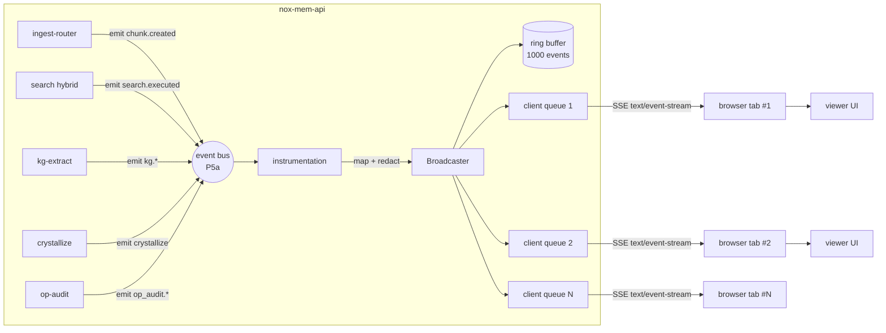

# nox-mem viewer — real-time SSE observability

> *"See your memory grow as it grows."*
>
> Live event stream + lightweight web UI rodando dentro do próprio
> `nox-mem-api`. Você abre uma aba, vê chunks aparecerem, searches
> rolando, KG extraindo entidades — em <500ms desde o commit no SQLite.
>
> Spec canônico: `specs/2026-05-17-P5-viewer-realtime.md`
> Kickoff de implementação: `specs/2026-05-18-P5-implementation-kickoff.md`
> Event bus subjacente: P5a, mergeado em PR #33.

---

## 1. Overview

O viewer é uma **product surface** dentro de `nox-mem` — não um dev tool
externo. Você acessa via navegador em
`http://127.0.0.1:18802/viewer/` (porta do `nox-mem-api`) e tem em uma
única tela:

- **Live log** dos eventos mais recentes (últimos 100 visíveis em DOM)
- **Counters** por tipo de evento (ingest / search / kg / crystallize / op_audit)
- **Stats bar** com events/sec e total do dia
- **Filtros** por tipo de evento (checkboxes)
- **Detalhe expandido** por evento (JSON completo, click pra expandir)

O backend serve isso via Server-Sent Events (`text/event-stream`) em
`GET /api/events/stream`. SSE foi escolhido sobre WebSocket porque o
fluxo é uni-direcional (server → viewer), o `EventSource` do browser
reconnecta automaticamente, e o stream funciona até via `curl -N` pra
debugging.

### Quando usar

- **Validar ingest watchers ao vivo** — viu o arquivo bater no `chunks`?
- **Investigar regressões de search** — latência subiu? mode mudou?
- **Acompanhar KG extraction nightly** — quantos entities por minuto?
- **Auditar op_audit** — reindex/consolidate/crystallize de pé?
- **Demonstrar pra cliente** — "olha a memória trabalhando agora".

### Quando NÃO usar

- Não é um dashboard histórico. Para 7d+ time-series → ver F10
  (`agent-hub-dashboard`).
- Não substitui logs persistentes. Eventos são live-only; o ring buffer
  guarda apenas os últimos N (default 1000).
- Não é graph visualization da KG (= P5b futuro).

---

## 2. Architecture



### Files

| File | Role |
|---|---|
| `src/lib/events/bus.ts` (P5a) | EventEmitter singleton; fire-forget `emitAsync` |
| `src/lib/viewer/event-types.ts` | Discriminated union `ViewerEvent`, type guards |
| `src/lib/viewer/instrumentation.ts` | Bus → ViewerEvent adapter, calls `redactEvent` |
| `src/lib/viewer/redaction.ts` | Default-deny policy + opt-in env |
| `src/lib/viewer/broadcast.ts` | Ring buffer + per-client queues, fan-out |
| `src/lib/viewer/backpressure.ts` | Bounded queue, drop-oldest semantics |
| `src/lib/viewer/auth.ts` | Optional token gate (env-driven) |
| `src/lib/viewer/session.ts` | Client id + telemetry session lifecycle |
| `src/lib/viewer/migration.ts` | Loads & applies `migrations/v20-...` |
| `src/api/events-stream.ts` | SSE handler (framework-agnostic async generator) |
| `src/api/viewer-static.ts` | Serves `/viewer/*.{html,js,css}` |
| `src/viewer/index.html` + `app.js` + `style.css` | Frontend (vanilla, <50KB) |
| `src/cli/viewer.ts` | `nox-mem viewer` opens browser |
| `src/mcp/tools/viewer.ts` | MCP tool `viewer_recent_events` |
| `migrations/v20-viewer-telemetry.sql` | Telemetry table additive migration |

### Data flow per event

1. Module (ingest/search/kg/...) calls `emit(EventKind.CHUNK_CREATED, payload)`
   from the P5a bus.
2. `emitAsync` schedules listeners via `setImmediate` — caller returns
   immediately. **Never blocks the DB write or response path.**
3. The instrumentation layer (`attachInstrumentation`) maps the raw payload
   into a typed `ViewerEvent` and runs `redactEvent()` on it.
4. The redacted event is published to the `Broadcaster`, which:
   - assigns a monotonic `id`,
   - appends to the global ring buffer,
   - pushes into each connected client's `BackpressureQueue`,
   - calls the per-client `notify()` to wake the SSE iterator.
5. Per-client async generator yields an SSE-formatted chunk
   (`id:` + `event:` + `data:` + blank line) which the HTTP server writes
   to the response stream.
6. Browser `EventSource` parses each frame and dispatches to the JS
   handler in `app.js`.

### Performance budget (locked, see spec §8)

| Concern | Budget |
|---|---|
| `emit()` overhead | <100µs |
| SSE write per event | <1ms |
| Ingest latency impact w/ viewer connected | 0% measurable |
| Search latency impact | 0% measurable |
| Frontend FPS at 100 ev/sec | ≥55 |
| 24h memory growth, one tab | <50MB |

---

## 3. Configuration env vars

| Var | Default | Purpose |
|---|---|---|
| `NOX_API_PORT` | `18802` | Port for the HTTP API (also serves `/viewer`). |
| `NOX_VIEWER_BIND` | `127.0.0.1` | Bind address. **Set to `0.0.0.0` only with a token.** |
| `NOX_VIEWER_AUTH_TOKEN` | *(unset)* | Token required as `Authorization: Bearer <token>` or `?token=<token>`. When unset, no auth. |
| `NOX_VIEWER_SHOW_QUERY` | *(unset)* | Set to `1` to surface raw search query text on `SearchEvent.query`. **Default: queries are `<redacted>`.** |
| `NOX_VIEWER_RING_SIZE` | `1000` | Max events buffered in the ring buffer (replay window). |
| `NOX_VIEWER_CLIENT_QUEUE_SIZE` | `100` | Max events queued per SSE client before drop-oldest kicks in. |
| `NOX_VIEWER_HEARTBEAT_MS` | `15000` | Heartbeat interval (proxy-defeating keepalive). |

When any privacy-loosening env is set, `viewerStartupWarnings()` emits a
`[WARN]` line on `stderr` at boot. Inspect logs in production.

### Examples

Local dev (default):

```bash
# Nothing to set — bind 127.0.0.1, no auth, query redacted.
node dist/api/server.js
```

Tailscale exposure (read-only, single operator):

```bash
NOX_VIEWER_BIND=0.0.0.0 \
NOX_VIEWER_AUTH_TOKEN="$(openssl rand -base64 32)" \
node dist/api/server.js
```

Debugging real query text (TEMPORARY, local only):

```bash
NOX_VIEWER_SHOW_QUERY=1 node dist/api/server.js
# stderr: [WARN] NOX_VIEWER_SHOW_QUERY=1 — raw queries visible on /api/events/stream.
```

---

## 4. Threat model + redaction

### Default-deny policy

Os campos abaixo NUNCA aparecem em `/api/events/stream` no default:

- Chunk content / body / text / prompt / response
- Embeddings / vector arrays
- Raw query text (apenas `query_hash` SHA-256 truncado)
- Raw KG entity names (apenas `name_hash` SHA-1 truncado)
- API keys, tokens, secrets (filtro por nome de campo)
- Absolute file paths (reduzidos pra basename)

### Implementation

`src/lib/viewer/redaction.ts` aplica em duas camadas:

1. **Per-kind**: cada mapper em `instrumentation.ts` constrói o
   `ViewerEvent` já sem campos sensíveis. Por exemplo,
   `mapKgEntityCreated` faz `name_hash: nameHash(p.name)` em vez de
   colocar `name` direto.
2. **Defensive sweep**: `stripForbiddenFields` percorre recursivamente
   o evento e remove qualquer chave em `FORBIDDEN_FIELDS` que tenha
   sneaked in por bug em outro módulo. Também reescreve strings que
   parecem paths absolutos pra basename.

### Opt-in: `NOX_VIEWER_SHOW_QUERY=1`

Único campo que pode ser surfacado em modo opt-in é o
`SearchEvent.details.query` (texto cru). Use APENAS pra debug local:

```bash
# Bom: investigando query lenta numa session local
NOX_VIEWER_SHOW_QUERY=1 nox-mem viewer

# RUIM: prod compartilhado, multi-user
# (mesmo um único operador conectado vê queries dos outros)
```

### Auth posture

- **Default 127.0.0.1 + no auth.** Funciona em single-user, single-host
  (laptop dev, VPS pessoal). Postura idêntica ao resto do `nox-mem-api`.
- **Bind 0.0.0.0** sem token: o WARN no boot avisa. O wizard refuta na
  V25 (tracking issue: TBD) — por enquanto, é responsabilidade do
  operator.
- **Bind 0.0.0.0 + token**: token de no mínimo 32 chars. Auth via header
  `Authorization: Bearer <token>` ou `?token=<token>` query (este último
  só porque `EventSource` browser não suporta custom headers).
- **Tailscale-only**: combinação default ACL Tailscale + bind 0.0.0.0 +
  token é defesa em profundidade. Não promete zero-trust.

### Token leak via query log

Quando você usa `?token=`, o nginx/access-log do reverse proxy pode
gravar o token. Mitigação: configure log filter pra strip `?token=` no
path, ou prefira o header path (curl).

---

## 5. Multi-client behavior

Cada conexão SSE recebe seu próprio `BackpressureQueue` com capacidade
`NOX_VIEWER_CLIENT_QUEUE_SIZE` (default 100). Isto significa:

- Um cliente lento (rede ruim, navegador suspenso) NÃO bloqueia outros.
- Quando a fila do cliente lento enche, o **oldest event é descartado**
  silenciosamente (drop-oldest). Counter `dropped` é incrementado.
- O ring buffer global (NOX_VIEWER_RING_SIZE, default 1000) é
  independente — drops do cliente lento não afetam ele.
- A cada heartbeat de 15s, o frontend recebe um comment line SSE
  (`: heartbeat ...`) que documenta `ring=N clients=M`. Operator pode
  inferir se há muitos clientes conectados.

### Reconexão (Last-Event-ID)

Quando o `EventSource` reconnecta após drop, ele envia o header
`Last-Event-ID: <ultimo-id>`. O Broadcaster procura no ring buffer
todos os envelopes com id > Last-Event-ID e os pre-seeda na fila do
cliente. Se o gap é maior que o ring (ex: server reiniciou e ring
zerou), o cliente recebe só os eventos futuros — eventos perdidos do
gap NÃO são reidratados (eles vivem em `chunks` / `ops_audit` no DB se
você precisar reconstruir).

### Fair share / DoS

O viewer é assumido single-user friendly. Se >50 clientes conectam
simultaneamente, o EventEmitter padrão atinge MAX_LISTENERS=50 (config
em `bus.ts`). Operator vê o warning Node em stderr e pode aumentar.

---

## 6. CLI / MCP / HTTP usage

### CLI

```bash
# Abre o browser default no URL do viewer local
nox-mem viewer

# Apenas imprime o URL (útil pra SSH + tunnel)
nox-mem viewer --print
# → http://127.0.0.1:18802/viewer/

# Em CI (process.env.CI=true), imprime ao invés de abrir
CI=true nox-mem viewer
```

### MCP

A tool `viewer_recent_events` deixa o Claude espiar a atividade recente
sem abrir SSE:

```json
{
  "name": "viewer_recent_events",
  "arguments": { "limit": 20, "type_filter": "search" }
}
```

Retorno:

```json
{
  "count": 20,
  "ring_size": 743,
  "filter": "search",
  "items": [
    { "id": 723, "ev": { "ts": "...", "type": "search", "source": "search-hybrid", "summary": "search hybrid 78ms", "details": { "query_hash": "abc123...", "query": "<redacted>", "latency_ms": 78, ... } } },
    ...
  ]
}
```

### HTTP

`GET /api/events/stream` — abre o SSE. Headers:
- `Authorization: Bearer <token>` (opcional, se `NOX_VIEWER_AUTH_TOKEN` set)
- `Last-Event-ID: <id>` (opcional, pra resume)

```bash
# Modo debug raw
curl -N http://127.0.0.1:18802/api/events/stream

# Output:
# : connected
#
# id: 1
# event: ingest
# data: {"ts":"2026-05-18T...","type":"ingest","source":"ingest-router","summary":"chunk 1 created","details":{...}}
#
# id: 2
# event: search
# data: {...}
#
# : heartbeat 2026-05-18T... ring=1024 clients=2
```

`GET /viewer/` — HTML frontend.
`GET /viewer/app.js`, `/viewer/style.css` — assets.

Outros endpoints relevantes:
- `GET /api/health` (existente) — counters source-of-truth.
- `GET /api/health/viewer` — `{ active_connections, total_connects_today, dropped }`.

---

## 7. Frontend customization

O frontend é vanilla JS/CSS/HTML. Edite no SSH, recarregue (Cmd+R):

- `index.html` — layout, badges, filtros.
- `app.js` — lógica SSE + render.
- `style.css` — paleta. Há tokens CSS (`--accent`, `--c-ingest`, etc).

### Mudar a paleta

```css
:root {
  --accent: #ff7a00;        /* laranja */
  --c-ingest: #2ea043;       /* verde */
  --c-search: #2188ff;       /* azul */
  --c-kg: #8957e5;           /* roxo */
  --c-crystallize: #d29922;  /* âmbar */
  --c-op_audit: #f85149;     /* vermelho */
}
```

### Mudar o limite de eventos visíveis no DOM

`app.js`:

```js
const MAX_VISIBLE = 100;  // baixar pra 50 em telas pequenas
```

### Adicionar novo painel

Crie um `<section>` em `index.html` e um listener no `boot()`. O
`EventSource` já entrega cada evento — basta consumir.

### Bundle size

Atual (sem dependências externas):

```
index.html  ~2.0 KB
app.js      ~4.0 KB
style.css   ~2.8 KB
total       ~8.8 KB
```

Bem abaixo do target <50KB. Você pode adicionar `uPlot` (40KB) pra
charts no futuro sem estourar.

---

## 8. Telemetry

Cada conexão SSE escreve uma row em `viewer_telemetry`
(migration v20):

```sql
CREATE TABLE viewer_telemetry (
  id              INTEGER PRIMARY KEY AUTOINCREMENT,
  client_id       TEXT    NOT NULL,
  ts_start        TEXT    NOT NULL,
  ts_last_event   TEXT,
  ts_end          TEXT,
  events_consumed INTEGER NOT NULL DEFAULT 0,
  events_dropped  INTEGER NOT NULL DEFAULT 0,
  remote_label    TEXT,
  user_agent_major TEXT,
  protocol_version INTEGER NOT NULL DEFAULT 1
);
```

- `client_id` — UUIDv4 mintado no connect (ou aceito do header
  `X-Viewer-Client-Id` / cookie `nox_viewer_id`).
- `ts_start` / `ts_end` — abre/fecha a sessão.
- `ts_last_event` — atualiza a cada evento consumido.
- `events_consumed` / `events_dropped` — contadores de sessão.
- `remote_label` — IP hashado se non-loopback, ou literal "loopback".

Active sessions: `SELECT COUNT(*) FROM viewer_telemetry WHERE ts_end IS NULL`.

---

## 9. Browser compat

- Chrome 90+
- Firefox 90+
- Safari 15+
- Edge 90+

EventSource API + ES modules são baseline. IE 11 não suportado.

---

## 10. Troubleshooting

### Stream não conecta (browser barra vermelha)

1. Confirma que `nox-mem-api` está rodando: `curl http://127.0.0.1:18802/api/health`.
2. Confirma que a porta está certa (`NOX_API_PORT` env vs URL).
3. Se `NOX_VIEWER_AUTH_TOKEN` set, passe `?token=...` na URL ou use o
   header Bearer.
4. Verifique proxy/reverse-proxy: precisa `proxy_buffering off` em
   nginx, `X-Accel-Buffering: no` é setado pelo handler mas o proxy
   pode reescrever.

### Eventos param de chegar (sem erro)

- Provavelmente o cliente entrou em backpressure (rede lenta, tab
  inativa). Tab volta a foreground → reconnect automático via
  `Last-Event-ID`.
- Verifique no `/api/health/viewer.dropped` — se subindo, ring buffer
  ou client queue estão saturados.

### Raw query não aparece

- Ative `NOX_VIEWER_SHOW_QUERY=1`. Boot log vai confirmar com WARN.
- Se ainda assim `<redacted>`, confirme que o env foi setado **antes**
  do server iniciar (não basta `export` em outra shell).

### Heartbeat ausente

- O comment `: heartbeat ...` chega a cada 15s. Se passa de 30s sem
  ele, o proxy provavelmente está bufferando. Adicione
  `proxy_buffering off` (nginx) ou `tcp.nodelay 1`.

### "Failed to launch browser"

`nox-mem viewer` usa `open` (macOS) / `xdg-open` (Linux) /
`cmd /c start` (Windows). Se nenhum disponível, use
`nox-mem viewer --print` e abra manualmente.

---

## 11. Future enhancements

Não estão em v1:

- **Charts panel** (uPlot, growth + latency + cost) — spec original
  panel C; deferido pra P5b.
- **Heatmap panel** (7×24 atividade) — spec original panel D; deferido
  pra P5b.
- **WebSocket fallback** — SSE basta. Long-poll documentado mas não
  implementado.
- **Mobile-optimized layout** — desktop-first; revisitar quando
  Hotmart tiers shipam.
- **Pause/resume com ring buffer mirror no client** — atualmente o
  filtro hide-show já cobre 80% do uso.
- **Multi-instance aggregation** — escopo de
  `agent-hub-dashboard` (F10 e além).
- **Configurar threshold de alert no frontend** — alerts ficam em
  invariants canary + Discord; viewer apenas **mostra**
  `health.warning`.
- **Export to CSV** — F10 escopo.

---

## 12. References

- Spec: `specs/2026-05-17-P5-viewer-realtime.md`
- Kickoff: `specs/2026-05-18-P5-implementation-kickoff.md`
- Event bus (P5a): `staged-P5a/edits/src/lib/events/bus.ts` (PR #33)
- Anti-overlap F10: `specs/2026-05-01-F10-observability-dashboard.md`
- Q/A/P pivot: `project_qap_pillars_strategic_decision.md`

> *"Pain-weighted hybrid memory with shadow discipline — yours by design."*
>
> P5 fecha o pilar P (Product surface): você vê tudo acontecer.
